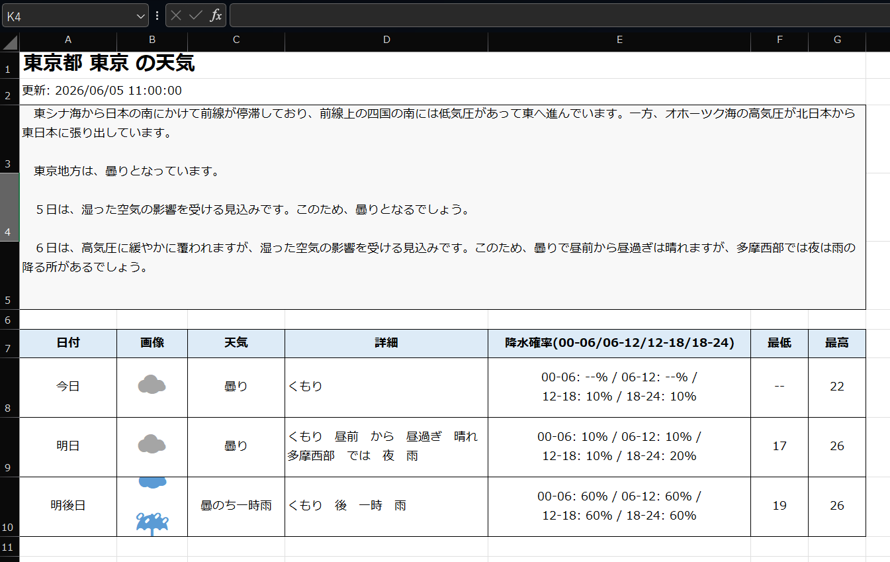
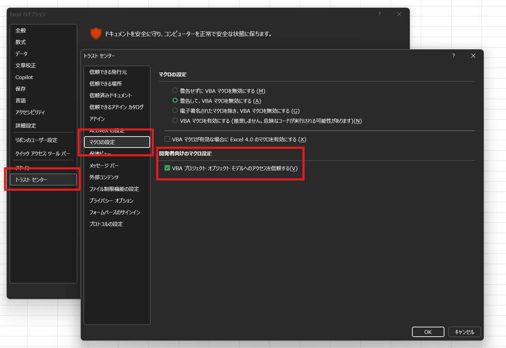

<p align="center">
    
</p>

<p align="center">
  <em>Excel VBA development, rebuilt for CLI-first humans and AI agents.</em>
</p>

<p align="center">
  <a href="https://harumiweb.github.io/xlflow/">公式ドキュメントサイト</a>
</p>

<p align="center">
  <a href="README.md">English</a>
  |
  <a href="README.ja.md">日本語</a>
</p>

<div align="center">

     [](https://deepwiki.com/harumiWeb/xlflow)

</div>

# :surfing_man: xlflow

**xlflow** は、AIエージェント時代のための Excel VBA 開発フレームワークです。

`.xlsm` ブックに閉じ込められがちな VBA を、ソース管理しやすく、CLI から扱いやすい開発ワークフローに変換します。
VBA のエクスポート、編集、lint、インポート、テスト、trace、実行、差分確認をコマンドラインから行えます。

> [!TIP]
> xlflow は Excel を置き換えるツールではありません。Excel VBA の周囲に CLI ベースの開発ハーネスを用意し、人間・スクリプト・AIエージェントが扱いやすい形にするためのツールです。

## デモ

これらの [サンプル](example) は xlflow を使用して僅かな自然言語指示のみでAIエージェントによって作成されました。

<table>
  <tr>
    <td align="center" width="50%">
      
      <sub>NewsAPIを使用して世界のニュースを Excel でまとめるマクロ</sub>
    </td>
    <td align="center" width="50%">
      
      <sub>株価を取得して Excel に表示するマクロ</sub>
    </td>
  </tr>
  <tr>
    <td align="center" width="50%">
      
      <sub>セル色表現で QRコードを生成して Excel に表示するマクロ</sub>
    </td>
    <td align="center" width="50%">
      
      <sub>Excel 上でテトリスをプレイできるマクロ</sub>
    </td>
  </tr>
  <tr>
    <td align="center" width="50%">
      
      <sub>ユーザーフォーム上でスペースインベーダーをプレイできるマクロ</sub>
    </td>
    <td align="center" width="50%">
      
      <sub>リッチなカレンダーピッカー</sub>
    </td>
  </tr>
  <tr>
    <td align="center" width="50%">
      
      <sub>リアルタイムの天気ニュースを表示するマクロ</sub>
    </td>
    <td align="center" width="50%">
      
      <sub>パックマン風ゲーム</sub>
    </td>
  </tr>
</table>

---

## なぜ xlflow が必要か

従来の VBA 開発は、Excel 画面と Visual Basic Editor に強く依存しています。
小さな手作業の修正であれば問題ありませんが、ソース管理、テスト、差分確認、AIエージェントによる修正、再現可能な実行を考えると扱いづらくなります。

| 通常の VBA 開発でつらいこと                    | xlflow でできること                                           |
| ---------------------------------------------- | ------------------------------------------------------------- |
| VBA コードが `.xlsm` の中に閉じ込められている  | `.bas` / `.cls` / `.frm` としてエクスポート・インポートできる |
| UserFormを宣言的に扱えない                     | `xlflow form build` で yaml 定義から UserForm を生成できる    |
| 実行エラーの場所や原因が分かりにくい           | 構造化エラー、診断情報、trace log を返せる                    |
| workbook の変更をレビューしにくい              | セル値、数式、シート、VBA ソースの差分を確認できる            |
| AIエージェントが Excel UI を安全に操作しにくい | CLI コマンドと安定した JSON 出力を提供できる                  |

```text
pull → fmt → edit → push → lint → test/run → inspect
```

---

## できること

| 領域               | 機能                                                                                                                            |
| ------------------ | ------------------------------------------------------------------------------------------------------------------------------- |
| ソース管理         | 標準モジュール、クラスモジュール、UserForm、Workbook / Worksheet モジュールをエクスポート・インポート                           |
| 実行               | CLI から型付き引数つきでマクロを実行                                                                                            |
| テスト             | VBA のテスト手続きを検出して実行                                                                                                |
| フォーマット       | `.bas` / `.cls` ソースファイルに対する保守的で非破壊な VBA フォーマット                                                         |
| lint               | `Option Explicit` 不足、`Select` / `Activate`、広すぎるエラー処理、暗黙の Variant、Public module field、対話的処理を検出        |
| GUI 安全性         | ファイル選択、`InputBox`、modal `MsgBox`、UserForm などの自動実行に不向きな境界を検出                                           |
| デバッグ           | trace event と runtime diagnostic を収集                                                                                        |
| 差分確認           | workbook のセル値、数式、シート構成、VBA ソース差分を比較                                                                       |
| AIエージェント連携 | 安定した JSON を返し、Codex / Claude / Cursor / Gemini / GitHub Copilot 風ワークフローなどに使わせるための Skill をインストール |

> [!IMPORTANT]
> xlflow は **Windows-first** のツールです。Workbook 操作には **Microsoft Excel + COM** と Windows 既定の `.NET` Excel bridge を使用し、PowerShell bridge は明示指定用の legacy fallback として維持されます。

---

## 動作要件

| 要件                                                       | 必要になる場面                                                                                                                                                                      |
| ---------------------------------------------------------- | ----------------------------------------------------------------------------------------------------------------------------------------------------------------------------------- |
| Windows                                                    | Excel COM automation                                                                                                                                                                |
| Microsoft Excel                                            | `new`, `init`, `list forms`, `inspect form`, `form snapshot`, `form build`, `form export-image`, `pull`, `push`, `run`, `export-image`, `edit`, `test`, `macros`, `trace`, `doctor` |
| VBA プロジェクト オブジェクト モデルへのアクセスを信頼する | VBA プロジェクトの読み書き                                                                                                                                                          |

> [!NOTE]
> `lint`、`fmt`、一部の `diff`、Go のユニットテストなど、Excel COM を使わない処理は非 Excel 環境でも検証できます。

> [!NOTE]
> xlflow はCOM操作を .NET bridgeで行うため、PowerShell は通常不要です。しかしレガシー実装として PowerShell bridge も存在し、こちらを使う場合は PowerShell 5.1 以降が必要です。

> [!WARNING]
> Excel の設定で **VBA プロジェクト オブジェクト モデルへのアクセスを信頼する** を有効にしてください。これが無効だと、Excel がインストールされていても `pull` / `push` / `run` などが失敗する場合があります。
>
> 詳細
> Excel のオプションで「トラスト センター」→「マクロの設定」→「VBA プロジェクト オブジェクト モデルへのアクセスを信頼する」を有効にしてください。
> 

---

## インストール

### winget

```powershell
winget install HarumiWeb.Xlflow
```

既存のインストールを更新する場合:

```powershell
winget upgrade HarumiWeb.Xlflow
```

> [!NOTE]
> winget は manifest を upstream へ提出して承認されるまで、GitHub Release より反映が遅れる場合があります。
> 最新 release をすぐに使いたい場合は、Scoop または GitHub Releases の ZIP を使ってください。

### Scoop

```powershell
scoop bucket add harumiweb https://github.com/harumiWeb/scoop-bucket
scoop install xlflow
```

### GitHub Releases

Windows 向けの事前ビルド済みバイナリは次のページから取得できます。

[https://github.com/harumiWeb/xlflow/releases](https://github.com/harumiWeb/xlflow/releases)

> [!IMPORTANT]
> 現在の事前ビルド配布は **Windows 向けのみ** です。
> Workbook を操作する command には、**Microsoft Excel**、Excel COM automation、**VBA プロジェクト オブジェクト モデルへのアクセスを信頼する** 設定が必要です。
> Windows 向け release ZIP には `xlflow.exe` と `xlflow-excel-bridge.exe` の両方が含まれます。Go CLI には runtime PowerShell bridge script も埋め込まれているため、workbook command のために sidecar `*.ps1` file を別配布する必要はありません。

> [!WARNING]
> `xlflow-excel-bridge.exe` は PowerShell execution policy の影響を受けませんが、AppLocker、WDAC、Defender / EDR policy、antivirus reputation、unsigned executable rule などでブロックされる可能性はあります。公開している checksum と GitHub attestation で確認できるのは artifact の integrity と provenance であり、Windows の Authenticode signing ではありません。

ダウンロードした ZIP は、公開されている `checksums.txt` と照合して SHA256 を確認できます。

```powershell
Get-FileHash .\xlflow_windows_x86_64.zip -Algorithm SHA256
certutil -hashfile .\xlflow_windows_x86_64.zip SHA256
```

表示された SHA256 が `checksums.txt` 内の `xlflow_windows_x86_64.zip` の値と一致することを確認してください。

> この確認で分かるのは、ダウンロードしたファイルが公開された checksum file と一致していることです。配布者の本人性を証明するものではなく、Windows の Authenticode signing の代替でもありません。

GitHub CLI では、GitHub Actions provenance attestation も検証できます。

```powershell
gh attestation verify .\xlflow_windows_x86_64.zip --repo harumiWeb/xlflow
```

> この検証で分かるのは、release artifact に対する GitHub artifact attestation が存在し、検証できることです。Windows の publisher certificate による Authenticode signing を意味するものではありません。

### Go install

```bash
go install github.com/harumiWeb/xlflow/cmd/xlflow@latest
```

`go install` は Go 環境に設定された module mirror や checksum database へアクセスすることがあります。source checkout からの開発や CI では、`go.mod` に書かれた Go version を正式サポート toolchain の source of truth としてください。リポジトリの CI / release workflow もその値から Go を解決します。

> [!WARNING]
> `go install` で入るのは `xlflow` 本体だけです。Windows の release ZIP に含まれる `.NET` bridge sidecar `xlflow-excel-bridge.exe` はインストールされません。
> `--bridge dotnet` を使いたい場合は Windows release archive から導入するか、source checkout で `task install` などを使って bridge を別途 build / install してください。

インストール後、次のコマンドで確認できます。

```bash
xlflow version
xlflow --help
```

開発中のリポジトリから直接実行する場合:

```bash
go run ./cmd/xlflow --help
```

Taskfile を使用している場合:

```bash
task run -- --help
```

---

## クイックスタート

### 1. プロジェクトを作成または初期化する

新しい xlflow プロジェクトと macro-enabled workbook を作成します。

```bash
xlflow new Book.xlsm
```

`new` は scaffold した VBA module を新しい workbook へ自動 `push` するため、その後の `pull` でも同じ初期状態から始められます。

既存の Excel ブックから始める場合は `init` を使用します。

```bash
xlflow init Book.xlsm
```

`init` はコピーした workbook から `src/` へ自動 `pull` するため、追加の bootstrap `pull` なしでそのまま source 編集を始められます。

AI エージェント向けの Skill も同時にインストールする場合:

```bash
xlflow new Book.xlsm --with-skill --agent codex
```

interactive な `xlflow new` / `xlflow init` では welcome banner を表示し、最新 GitHub Release を GitHub Releases API で確認することがあります。このリクエストを今回だけ止めたい場合は `--no-update-check`、環境全体で止めたい場合は `XLFLOW_NO_UPDATE_CHECK=1` を使ってください。

### 2. Excel automation 環境を確認する

```bash
xlflow doctor --json
```

> [!TIP]
> `pull` / `push` / `run` / `test` が Excel、COM、bridge、VBIDE 設定の問題で失敗する場合は、まず `doctor` を実行してください。

### 3. VBA をソースファイルとして取り出す

```bash
xlflow pull --json
```

エクスポートされた `.bas` / `.cls` / `.frm` は `src/` 配下に出力されます。
folder mode が有効な場合、各 source root 配下のネストしたディレクトリは `push` 時に Rubberduck 互換の `@Folder(...)` annotation へマッピングされます。
通常のエディタや AI エージェントで編集できます。

### 4. 編集したソースを workbook に反映する

```bash
xlflow push --json
```

### 5. マクロを検出して実行する

```bash
xlflow macros --json
xlflow run Main.Run --json
```

無人実行では headless mode を推奨します。

```bash
xlflow run Main.Run --headless --json
```

マクロが `XlflowUI.MsgBox` や `XlflowUI.InputBox` を使う場合は、scripted response を渡すことで headless のまま実行できます。JSON stdout を壊さずにダイアログ解決の様子をターミナルへリアルタイム表示したい場合は `--ui-stream` を付けてください。

```bash
xlflow run Main.Run --headless --msgbox confirm-save=yes --inputbox customer-name=fallback-user --ui-stream --json
```

`--ui-stream` は `xlflow: ui kind=msgbox id=confirm-save source=default result=yes` のような行を stderr に出力します。InputBox の値は既定で redact され、`--ui-stream` を有効にした実行では最終 JSON 結果にも同じダイアログイベントが top-level の `ui.events` として含まれます。

ファイル選択、MsgBox、UserForm などを人間が操作する場合は interactive mode を使用します。

```bash
xlflow run Main.Run --interactive --timeout 5m --json
```

### 6. lint と test を実行する

```bash
xlflow lint --json
xlflow test --json
```

テストが `XlflowUI` を使う場合も、同じ response flag と realtime stream を使えます。

```bash
xlflow test --msgbox test-confirm=ok --inputbox test-user=alice --ui-stream --json
```

---

## よく使うワークフロー

### AIエージェントに VBA を編集させる

#### Skill をインストールする

AIエージェントに xlflow を使って VBA を編集させる場合、xlflow が提供している **Skill** をエージェントの環境にインストールすることを推奨します。

```bash
xlflow skill install
```

プロジェクトの立ち上げと同時にインストールすることもできます。

```bash
xlflow new Book.xlsm --with-skill
```

スキルを`vercel-labs/skills`などのマネージャーで管理したい場合などは以下のようにスキルをインストールしてください。

```bash
npx skills add harumiWeb/xlflow/internal/agentskill/templates --skill xlflow
```

#### プロジェクトを作成する

プロジェクトを作成させるところからAIエージェントに任せることもできますが、最初のプロジェクトセットアップは人間が行うことを推奨します。

```bash
xlflow new Book.xlsm --with-skill
```

#### AIエージェントに編集させる

インストールしたスキルを使って、あなたが実現したいことを自然言語で指示してください。

```bash
/xlflow VBAでセルA1に"Hello, world!"と入力するマクロを作成して
```

同梱されている xlflow skill は、headless な `XlflowUI` フローで `--ui-stream` をいつ付けるべきか、stdout の JSON をどう安全に保つか、実行後の human-readable `UI` section や JSON の `ui.events` をどう読むかもガイドします。

### 人間が Excel を操作しながら進める

人間が Excel を開いた状態で作業する場合は、`attach` で active workbook を確認できます。

```bash
xlflow attach --active --json
```

> [!NOTE]
> `attach` は安全確認用です。active workbook が `xlflow.toml` の `excel.path` と一致するかを検証します。`pull` / `push` / `run` の対象を切り替えるコマンドではありません。

Windows では `attach`、`session`、`runner`、`list forms`、`ui button`、`edit`、`new` も明示 `--bridge dotnet` に対応しています。

### GUI を含むマクロを扱う

headless 実行できるか判断する前に、GUI boundary を確認します。

```bash
xlflow inspect-gui --json
```

| 結果                                                          | 推奨される対応方法                                          |
| ------------------------------------------------------------- | ----------------------------------------------------------- |
| GUI boundary なし                                             | `xlflow run ... --headless --json`                          |
| ファイル選択、`InputBox`、modal `MsgBox`、UserForm などを検出 | `XlflowUI.MsgBox` や `XlflowUI.InputBox` を使用してください |
| GUI 処理が実処理を包んでいる                                  | core logic を引数付きの headless 手続きへ分離する           |

> [!WARNING]
> headless automation と modal な Excel UI は相性が悪いです。無人実行前に `inspect-gui` を使い、既存の `MsgBox` や `InputBox` は `XlflowUI` を使うように置き換えることを推奨します。

### 実行モードを VBA から参照する

新しく `xlflow new` で作るプロジェクトには `src/modules/XlflowRuntime.bas` が含まれます。`xlflow run` や `xlflow test` の実行前に、xlflow は workbook-scoped の実行モード marker を一時注入するため、VBA 側は process inspection に頼らずに分岐できます。

```vb
If XlflowRuntime.IsHeadless() Then
  Debug.Print "running unattended in " & XlflowRuntime.ModeName()
Else
  MsgBox "Running interactively"
End If
```

`run --headless` は `headless`、`run --interactive` は `interactive`、`test` は `test` に解決されます。plain `run` は、xlflow 実行プロセスの環境変数 `XLFLOW_MODE=interactive|headless|ci|agent|test` が無い限り `interactive` にフォールバックします。

---

## コマンドマップ

| コマンド            | 目的                                                              | 代表的な使い方                                                               |
| ------------------- | ----------------------------------------------------------------- | ---------------------------------------------------------------------------- |
| `new`               | 新しい xlflow プロジェクトと `.xlsm` workbook を作成              | `xlflow new Book.xlsm`                                                       |
| `init`              | 既存 workbook から xlflow プロジェクトを初期化                    | `xlflow init Book.xlsm`                                                      |
| `doctor`            | Excel、COM、PowerShell、VBIDE access を診断                       | `xlflow doctor --json`                                                       |
| `attach`            | Excel で現在 active な workbook を検証                            | `xlflow attach --active --json`                                              |
| `backup list`       | rollback 用 workbook backup を一覧表示                            | `xlflow backup list --json`                                                  |
| `pull`              | VBA component を `src/` へエクスポート                            | `xlflow pull --json`                                                         |
| `push`              | VBA source を workbook へインポート                               | `xlflow push --json`                                                         |
| `rollback`          | 保存済み backup から workbook を復元                              | `xlflow rollback --latest --json`                                            |
| `session`           | 高速ループ用に workbook を開いたままにする                        | `xlflow session start`                                                       |
| `status`            | プロジェクト、source、workbook、session の状態を表示              | `xlflow status --json`                                                       |
| `save`              | session 中の workbook を保存                                      | `xlflow save --session --json`                                               |
| `runner`            | 永続 xlflow runner marker module を管理                           | `xlflow runner install --json`                                               |
| `process`           | ローカル Excel プロセスの管理 (一覧表示、終了)                    | `xlflow process list --json`                                                 |
| `macros`            | 実行可能な macro entrypoint を検出                                | `xlflow macros --json`                                                       |
| `list forms`        | workbook の UserForm と想定 source path を列挙                    | `xlflow list forms --json`                                                   |
| `form snapshot`     | 厳密な Designer UserForm state を JSON/YAML spec に保存           | `xlflow form snapshot UserForm1 --out src/forms/specs/UserForm1.yaml --json` |
| `form build`        | 保存済み spec から Designer-backed UserForm を作成                | `xlflow form build src/forms/specs/UserForm1.yaml --json`                    |
| `form export-image` | runtime UserForm を PNG 画像として出力                            | `xlflow form export-image UserForm1 --out artifacts/UserForm1.png --json`    |
| `run`               | CLI から macro を実行                                             | `xlflow run Main.Run --json`                                                 |
| `export-image`      | worksheet range を PNG 画像として出力                             | `xlflow export-image --sheet QR --range A1:AE31 --json`                      |
| `edit`              | live session workbook を準備・調整用に変更する                    | `xlflow edit cell --sheet Input --cell B2 --value ABC123 --session --json`   |
| `trace`             | VBA trace log を有効化・収集・削除                                | `xlflow trace enable --json`                                                 |
| `test`              | VBA test を実行                                                   | `xlflow test --json`                                                         |
| `diff`              | workbook 内容と任意の VBA source を比較                           | `xlflow diff before.xlsm after.xlsm --json`                                  |
| `inspect`           | 保存済み workbook snapshot または明示的な live session 状態を確認 | `xlflow inspect range --sheet Result --address A1:F20 --session --json`      |
| `lint`              | VBA source を lint                                                | `xlflow lint --json`                                                         |
| `fmt`               | VBA source を保守的にフォーマット                                 | `xlflow fmt --write --json`                                                  |
| `analyze`           | Excel を開かず runtime-risk pattern を解析                        | `xlflow analyze --json`                                                      |
| `check`             | `lint` / `analyze` / `doctor` をまとめて実行                      | `xlflow check --keepalive --json`                                            |
| `inspect-gui`       | GUI interaction boundary を検出                                   | `xlflow inspect-gui --json`                                                  |
| `skill install`     | AI エージェント向け Skill をインストール                          | `xlflow skill install --agent codex`                                         |
| `version`           | インストール済み xlflow の build metadata を表示                  | `xlflow version`                                                             |

---

## コマンド詳細

各コマンドの詳しい挙動、オプション、JSON 出力、トラブルシューティングはドキュメントサイトへ移しました。

- [Command reference](https://harumiweb.github.io/xlflow/commands/)
- [JSON output](https://harumiweb.github.io/xlflow/reference/json-output)
- [Configuration](https://harumiweb.github.io/xlflow/reference/config-file)
- [Troubleshooting](https://harumiweb.github.io/xlflow/reference/troubleshooting)

README は概要と最短導線に絞り、詳細はドキュメントサイトを参照してください。

---

## 設定ファイル

xlflow はプロジェクトルートの `xlflow.toml` を読み込みます。

```toml
# プロジェクトの識別情報およびエントリポイント
[project]
# 出力メッセージで使用するプロジェクト名。省略時はワークブックのベース名が使用されます。
name = "Book"
# xlflow run実行時にマクロが指定されなかった場合に呼び出されるデフォルトのマクロ。
entry = "Main.Run"

# Excelの自動化設定
[excel]
# ワークブックへのパス。プロジェクトルートからの相対パス、または絶対パスで指定します。
path = "build/Book.xlsm"
# 自動化中にExcelアプリケーションのウィンドウを表示するかどうか。
visible = false
# Excelの警告ダイアログ（上書き確認など）を抑制します。
display_alerts = false

# ソースツリーのディレクトリ
[src]
# 標準モジュール（.bas）用のディレクトリ。
modules = "src/modules"
# クラスモジュール（.cls）用のディレクトリ。
classes = "src/classes"
# ユーザーフォーム（.frm）ファイル用のディレクトリ。
forms = "src/forms"
# ワークブックのドキュメントモジュール用テキストのディレクトリ。
workbook = "src/workbook"

# VBEコンポーネントのフォルダサポート（Rubberduckスタイル）
[vba]
# @Folder("A.B") アノテーションとネストされたソースパスを有効にします。
folders = true
# push実行時にxlflowが @Folder アノテーションをどのように扱うか。
# 指定可能な値: "update", "preserve", "ignore"
#   "update"    – ソースディレクトリのレイアウトに基づいて書き換えます。
#   "preserve"  – 既存のアノテーションをそのまま保持します。
#   "ignore"    – フォルダアノテーションの読み書きを無効にします。
folder_annotation = "update"
# ソースパスに基づいてデフォルトのフォルダアノテーションを自動的に割り当てます。
default_component_folders = true

# ユーザーフォームのソースモード
[userform]
# ユーザーフォームのコードビハインドがソースツリーのどこに配置されるか。
# 指定可能な値: "frm", "sidecar"
#   "frm"     – コードはエクスポートされた .frm ファイル内に保持されます。
#   "sidecar" – コードは src/forms/code/<フォーム名>.bas に分離されます。
code_source = "sidecar"

# 静的解析ルール
[lint]
# すべてのモジュールで Option Explicit を必須にします。
require_option_explicit = true
# Select / Activate パターンの使用を禁止します。
forbid_select = true
# Activate の使用を禁止します。
forbid_activate = true
# On Error Resume Next の使用を禁止します。
forbid_on_error_resume_next = true
# 暗黙的に型指定された Variant 変数を検出します。
detect_implicit_variant = true
# 標準モジュール内でのパブリックフィールドの使用を禁止します。
forbid_public_module_fields = true
# ヘッドレス実行時の対話型入力（MsgBox、InputBoxなど）を禁止します。
forbid_interactive_input = true
```

`project.entry` は `xlflow run` の macro 名を省略した場合に使われます。

対話前提の project で `UserForm` やダイアログを意図的に使う場合は、`forbid_interactive_input = false` にすると `VB007` 警告を抑止できます。これは lint だけに効き、`xlflow run --headless` の GUI 境界チェックは引き続きブロックします。

typographic quote、C-style quote escape、閉じられていないまたは対応がずれた procedure、行継続 `_` の空白不足を検出する構文安全 lint は常に有効です。`push` や `run` が Excel を開く前に VBE compile dialog を防ぐためのルールです。

---

## xlflow 専用組み込みモジュール

新しい project では、workbook 側 helper module として

- `src/modules/XlflowRuntime.bas`
- `src/modules/XlflowUI.bas`
- `src/modules/XlflowDebug.bas`
- `src/modules/XlflowAssert.bas` が scaffold されます。

各モジュールの目的は次の通りです。

- `XlflowRuntime` は `interactive` / `headless` / `ci` / `agent` / `test` の実行モード分岐に使います。
- `XlflowUI` は `MsgBox`、`InputBox`、`Application.GetOpenFilename`、open `Application.FileDialog`、`Application.GetSaveAsFilename`、folder picker を包み、同じ VBA を対話実行と無人実行の両方で使えるようにします。
- `XlflowDebug` は `XlflowDebug.Log` を `xlflow run` / `xlflow test` 中のターミナルへミラーしつつ、通常の VBA Immediate Window 出力も維持します。
- `XlflowAssert` は workbook 側 test で使う最小限の scalar assertion helper です。

例:

```vb
Dim answer As VbMsgBoxResult
Dim files As Variant

answer = XlflowUI.MsgBox("confirm-save", "Save workbook?", vbYesNo + vbQuestion, "Orders")
files = XlflowUI.GetOpenFilename("source-files", MultiSelect:=True)
XlflowDebug.Log "running in", XlflowRuntime.ModeName()
```

無人実行では CLI から dialog response を与えます。

```bash
xlflow run Main.Run --headless --msgbox confirm-save=yes --filedialog get-open:source-files=C:\temp\a.txt --filedialog get-open:source-files=C:\temp\b.txt --ui-stream --json
```

headless file dialog を Cancel 扱いにしたい場合は `@cancel` を使います。

```bash
xlflow run Main.Run --headless --filedialog folder:export-dir=@cancel --json
```

既存 project に bundled helper module を導入したい場合は、bootstrap 時か後付けで次の command を使えます。

```bash
xlflow init LegacyBook.xlsm --with-module
xlflow module install --push
```

---

## JSON 出力

すべてのコマンドは `--json` を付けることで、AIエージェントやスクリプトから扱いやすい JSON を返します。

基本的な envelope は次の形式です。

```json
{
  "status": "ok",
  "command": "lint",
  "error": null,
  "logs": []
}
```

失敗時は `status` が `failed` になり、`error.code` と `error.message` が返ります。

```json
{
  "status": "failed",
  "command": "run",
  "error": {
    "code": "macro_failed",
    "message": "Main Err 5: inputPath is required",
    "source": "Main",
    "number": 5,
    "phase": "invoke_macro"
  },
  "logs": []
}
```

> [!TIP]
> AIエージェントや自動化スクリプトでは、`status`、`command`、`error.code`、各コマンド固有の top-level field を主な contract として扱うことを推奨します。

---

## Exit code

| Code | 意味                                           |
| ---: | ---------------------------------------------- |
|  `0` | 成功                                           |
|  `1` | lint、macro、test などの検証失敗               |
|  `2` | CLI 引数または設定エラー                       |
|  `3` | Excel、COM、VBIDE、PowerShell などの環境エラー |

> [!NOTE]
> `diff` は差分が見つかった場合でも exit code `0` を返します。差分の有無は `diff.summary.total_diffs` を確認してください。

---

## License

MIT License. See [LICENSE](LICENSE).
