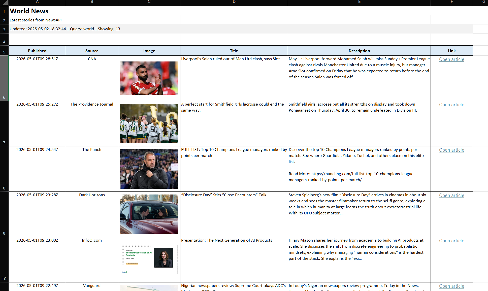
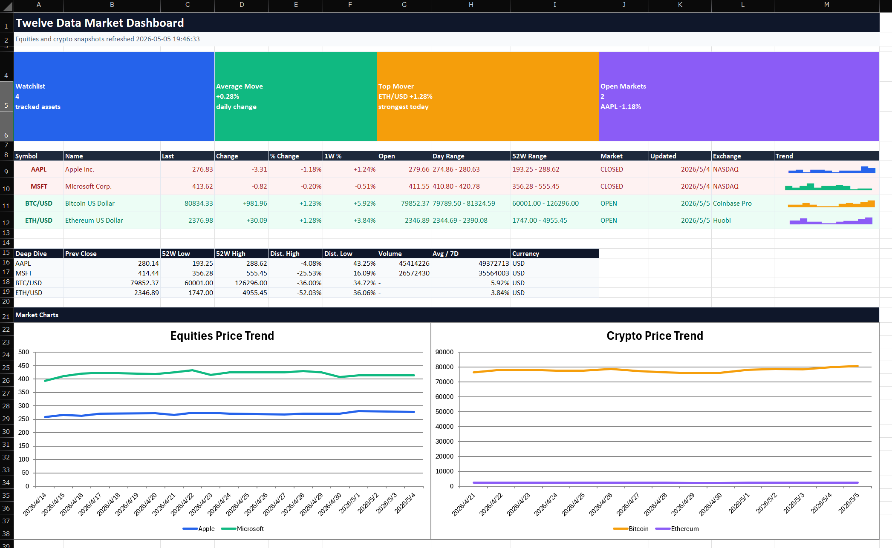
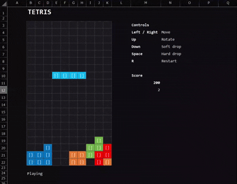
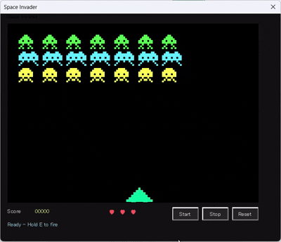
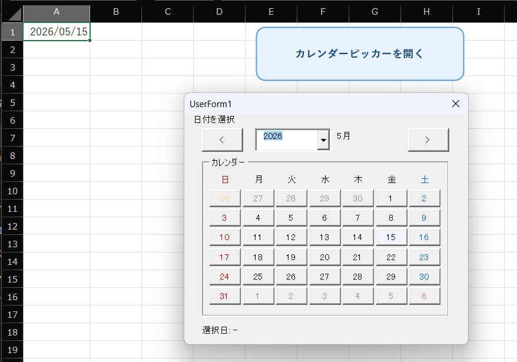
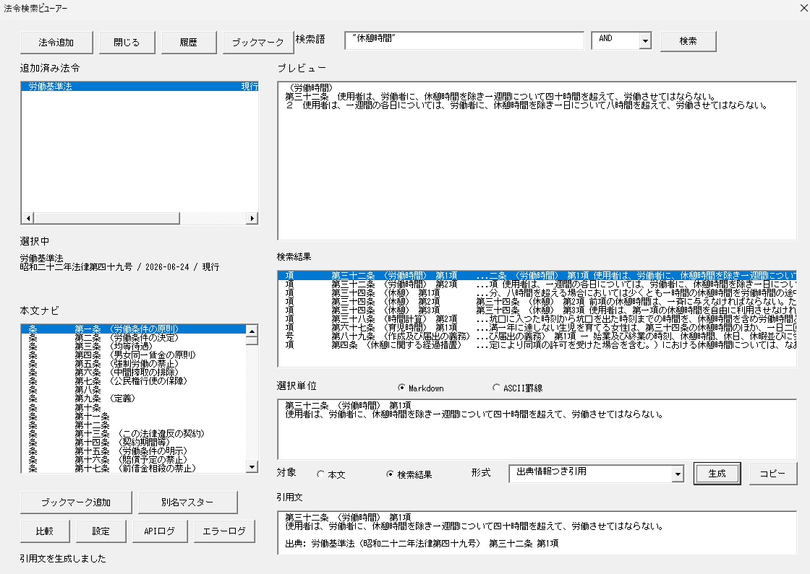
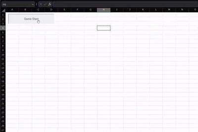

<p align="center">
    
</p>

<p align="center">
  <em>Excel VBA development, rebuilt for CLI-first humans and AI agents.</em>
</p>

<p align="center">
  <a href="https://harumiweb.github.io/xlflow/">Official Documentation</a>
</p>

<p align="center">
  <a href="README.md">English</a>
  |
  <a href="README.ja.md">日本語</a>
</p>

<div align="center">

     
 [](https://deepwiki.com/harumiWeb/xlflow)

</div>

# :surfing_man: xlflow

**xlflow** is an Excel VBA development framework for the AI agent era.

It turns `.xlsm` workbooks into a source-controlled, CLI-driven development workflow where VBA can be exported, edited, linted, imported, tested, and executed from the command line.


> [!TIP]
> Think of xlflow as a development harness around Excel VBA: it does not replace Excel, but it makes Excel VBA projects much easier to operate from terminals, scripts, CI-like local checks, and AI coding agents.

## Demo

These [samples](example) were created by an AI agent using xlflow with only minimal natural language instructions.

<table>
  <tr>
    <td align="center" width="50%">
      
      <sub>Macro that summarizes world news in Excel using NewsAPI</sub>
    </td>
    <td align="center" width="50%">
      
      <sub>Macro that retrieves stock prices and displays them in Excel</sub>
    </td>
  </tr>
  <tr>
    <td align="center" width="50%">
      
      <sub>Macro that generates QR codes using cell colors and displays them in Excel</sub>
    </td>
    <td align="center" width="50%">
      
      <sub>Macro that allows playing Tetris within Excel</sub>
    </td>
  </tr>
  <tr>
    <td align="center" width="50%">
      
      <sub>Macro that allows playing Space Invader on a UserForm</sub>
    </td>
    <td align="center" width="50%">
      
      <sub>Rich calendar picker</sub>
    </td>
  </tr>
    <tr>
    <td align="center" width="50%">
      
      <sub>Legal Act Data Search Tool</sub>
    </td>
    <td align="center" width="50%">
      
      <sub>Pac-Man style game</sub>
    </td>
  </tr>
</table>

---

## Why xlflow?

Traditional VBA development is still heavily tied to the Excel UI and the Visual Basic Editor.
That works for small manual edits, but it becomes painful when you want repeatable development, source control, tests, diffs, or AI-agent-assisted changes.

| Pain in normal VBA development                       | What xlflow adds                                                  |
| ---------------------------------------------------- | ----------------------------------------------------------------- |
| VBA code is trapped inside `.xlsm` files             | Export/import VBA as `.bas`, `.cls`, and `.frm` source files      |
| UserForms cannot be handled declaratively            | Generate UserForms from YAML definitions with `xlflow form build` |
| Runtime failures are hard to locate                  | Return structured errors, diagnostics, and terminal logs          |
| Workbook changes are hard to review                  | Compare values, formulas, sheets, and exported VBA source         |
| AI agents cannot safely operate Excel through the UI | Provide stable CLI commands and JSON output                       |

```text
pull → fmt → edit → push → lint → test/run → inspect
```

---

## What xlflow can do

| Area                                              | Capabilities                                                                                                                                                                 |
| ------------------------------------------------- | ---------------------------------------------------------------------------------------------------------------------------------------------------------------------------- |
| Source control                                    | Export and import standard modules, class modules, UserForms, and document modules                                                                                           |
| Formula snapshots                                 | Extract worksheet formulas and defined names into region-based JSONL files with `xlflow formulas pull` or refresh them with `xlflow pull --formulas`                         |
| Execution                                         | Run macros from the CLI with typed arguments                                                                                                                                 |
| Testing                                           | Discover and run VBA test procedures                                                                                                                                         |
| Formatting                                        | Conservative, non-destructive VBA formatting for `.bas` and `.cls` source files                                                                                              |
| Linting                                           | Catch `Option Explicit` omissions, `Select`/`Activate`, broad error handling, implicit variants, unqualified Excel objects, public module fields, and interactive operations |
| Debugging                                         | Collect terminal logs and return runtime diagnostics                                                                                                                         |
| Diffing                                           | Compare workbook cell values, formulas, sheet structure, and exported VBA source                                                                                             |
| AI agents                                         | Return stable JSON and install bundled Skills for Codex, Claude, Cursor, Gemini, GitHub Copilot-style agent workflows, and other agents                                      |
| LSP Server                                        | Provides features like code completion, jump-to-definition, and real-time diagnostics                                                                                        |
| [VS Code Extension](<(editors/vscode/README.md)>) | Graphical user interface for all xlflow operations, offering an enhanced development experience with the LSP server                                                          |

Formula snapshots can also be created outside an xlflow workspace:

```bash
xlflow formulas pull --src Book.xlsx --out formulas --json
```

Inside an xlflow workspace, use `xlflow pull --formulas --json` to refresh formula snapshots after a successful VBA pull.

> [!IMPORTANT]
> xlflow is **Windows-first** for workbook execution. Workbook operations use **Microsoft Excel + COM** through the `.NET` Excel bridge by default on Windows. WSL can be used as the development frontend by delegating Excel-related commands to the Windows installation.

---

## Requirements

| Requirement                                  | Needed for                                                                                                                                                                 |
| -------------------------------------------- | -------------------------------------------------------------------------------------------------------------------------------------------------------------------------- |
| Windows                                      | Excel COM automation                                                                                                                                                       |
| Microsoft Excel                              | `new`, `init`, `list forms`, `inspect form`, `form snapshot`, `form build`, `form export-image`, `pull`, `push`, `run`, `export-image`, `edit`, `test`, `macros`, `doctor` |
| Trust access to the VBA project object model | Reading and writing VBA projects                                                                                                                                           |

> [!NOTE]
> Commands that do not require Excel COM, such as `lint`, `fmt`, `formulas pull`, parts of `diff`, and Go unit tests, can be verified in non-Excel environments.

> [!NOTE]
> xlflow uses the .NET bridge for Excel COM operations. The legacy PowerShell bridge was removed in v0.16.0; supported bridge modes are `auto` and `dotnet`.

> [!WARNING]
> In Excel, enable **Trust access to the VBA project object model** before using commands that read or write VBA code. Without it, `pull`, `push`, `run`, and related commands may fail even when Excel itself is installed.
>
> Details
> In Excel options, please enable "Trust Center" → "Macro Settings" → "Trust access to the VBA project object model".
> 

---

## Installation

### Quick install

For the fastest path for humans and AI agents:

```powershell
irm https://harumiweb.github.io/xlflow/install.ps1 | iex
```

### Uninstall

Use the same script in file mode when you want to remove the PATH entry and the `%LOCALAPPDATA%\xlflow` installation directory:

```powershell
irm https://harumiweb.github.io/xlflow/install.ps1 -OutFile .\install.ps1
powershell -ExecutionPolicy Bypass -File .\install.ps1 -Action uninstall
```

### winget

```powershell
winget install HarumiWeb.Xlflow
```

Use `upgrade` to update an existing installation:

```powershell
winget upgrade HarumiWeb.Xlflow
```

> [!NOTE]
> winget availability may lag behind a GitHub Release while the manifest is submitted and accepted upstream.
> Use the installer script, Scoop, or the GitHub Releases ZIP when you need the newest release immediately.

### Scoop

```powershell
scoop bucket add harumiweb https://github.com/harumiWeb/scoop-bucket
scoop install xlflow
```

### GitHub Releases

Download prebuilt Windows and Linux x64 binaries from:

[https://github.com/harumiWeb/xlflow/releases](https://github.com/harumiWeb/xlflow/releases)

> [!IMPORTANT]
> Commands that interact with workbooks still require **Microsoft Excel**, Excel COM automation, and **Trust access to the VBA project object model** on Windows.
> The Windows release ZIP includes both `xlflow.exe` and `xlflow-excel-bridge.exe`. Workbook-backed commands use the bundled `.NET` bridge in `auto` mode.
> The Linux x64 archive contains the WSL/frontend CLI only and does not include the Windows `.NET` bridge.
> Release artifacts are built natively per OS because xlflow uses CGO for VBA source parsing: Windows releases use MSYS2 UCRT64 GCC, and Linux releases use the native Ubuntu GCC toolchain.

> [!WARNING]
> `xlflow-excel-bridge.exe` avoids PowerShell execution policy, but it can still be blocked by AppLocker, WDAC, Defender or EDR policy, antivirus reputation, or unsigned-executable rules. The published checksum and GitHub attestation verify artifact integrity and provenance; they do not provide Windows Authenticode signing.

Verify the downloaded Windows ZIP against the published `checksums.txt` file:

```powershell
Get-FileHash .\xlflow_windows_x86_64.zip -Algorithm SHA256
certutil -hashfile .\xlflow_windows_x86_64.zip SHA256
```

The reported SHA256 must match the entry for `xlflow_windows_x86_64.zip` in `checksums.txt`.

For the Linux archive, verify `xlflow_linux_x86_64.tar.gz` against `checksums-linux.txt`.

> This confirms file integrity against the published checksum file. It does not prove publisher identity and is not a substitute for Windows Authenticode signing.

Verify the GitHub Actions provenance attestation with GitHub CLI:

```powershell
gh attestation verify .\xlflow_windows_x86_64.zip --repo harumiWeb/xlflow
```

> This confirms the artifact attestation published for the release artifact. It does not mean the ZIP is Authenticode-signed by a Windows publisher certificate.

### Go install

```bash
go install github.com/harumiWeb/xlflow/cmd/xlflow@latest
```

`go install` may contact the Go module mirror and checksum database configured in your Go environment. For direct source checkout development and CI, treat the Go version declared in `go.mod` as the supported toolchain source of truth; the repository CI and release workflows resolve Go from that file.

> [!WARNING]
> `go install` installs `xlflow` only. It does not install the packaged `.NET` bridge sidecar `xlflow-excel-bridge.exe` used by Windows release ZIPs.
> The Windows release archive includes the `.NET` bridge sidecar. From a source checkout, use `task install` so both `xlflow.exe` and `xlflow-excel-bridge.exe` are installed together.

Verify the installation:

```bash
xlflow version
xlflow --help
```

For development checkout usage:

```bash
go run ./cmd/xlflow --help
```

With Taskfile:

```bash
task run -- --help
```

---

## WSL Development

WSL can be used as the editing and automation frontend while Windows remains the Excel execution backend.
Excel is not started inside WSL; workbook commands are delegated to the Windows `xlflow.exe`, which then uses the bundled `.NET` bridge and Microsoft Excel COM automation.

Recommended setup:

1. Install xlflow on Windows first, using the installer, winget, Scoop, or the Windows release ZIP.
2. Install the WSL frontend from a WSL shell:

```bash
curl -fsSL https://harumiweb.github.io/xlflow/install.sh | sh
```

3. Keep xlflow projects under a Windows-mounted path such as `/mnt/c/dev/my-vba-project`.

> [!WARNING]
> Projects under WSL-only paths such as `/home/user/project` are not supported for delegated Excel automation because Windows Excel and COM need a Windows-visible workbook path.

Run diagnostics from WSL before starting work:

```bash
xlflow doctor --json
```

Use `xlflow doctor --workbook --json` when you also want to verify that Windows Excel can open the configured workbook.

If the Windows executable is not discoverable from WSL, point xlflow at it explicitly:

```bash
export XLFLOW_WINDOWS_EXE='C:\Users\you\AppData\Local\xlflow\xlflow.exe'
```

For day-to-day macro development, use a session so Excel stays open across the edit loop:

```bash
xlflow session start --json
xlflow push --fast --session --no-save --json
xlflow run Main.Run --session --json
xlflow inspect cell --sheet Sheet1 --address A1 --session --json
xlflow save --session --json
xlflow session stop --json
```

Source-only commands such as `lint`, `fmt`, `analyze`, and `diff` can run locally in WSL. Excel-backed commands such as `new`, `init`, `pull`, `push`, `run`, `test`, `inspect`, `save`, and `doctor` delegate to Windows automatically.

---

## Quick start

### 1. Create or initialize a project

Create a new xlflow project and macro-enabled workbook:

```bash
xlflow new Book.xlsm
```

`new` automatically pushes the scaffolded VBA modules into the new workbook, so a later `pull` starts from the same initial source.

Or start from an existing workbook:

```bash
xlflow init Book.xlsm
```

`init` automatically pulls VBA out of the copied workbook into `src/`, so you can edit source files immediately without a separate bootstrap `pull`.

Install the AI agent Skill during project creation:

```bash
xlflow new Book.xlsm --with-skill --agent codex
```

Interactive `xlflow new` and `xlflow init` render a welcome banner and may check the latest GitHub Release through the GitHub Releases API. Disable that request for one invocation with `--no-update-check`, or set `XLFLOW_NO_UPDATE_CHECK=1` to disable it for interactive scaffolding in your environment.

### 2. Check the Excel automation environment

```bash
xlflow doctor --json
```

> [!TIP]
> `doctor` is lightweight by default. If you need to prove the configured workbook can be opened, run `xlflow doctor --workbook --json`.
>
> If `pull`, `push`, `run`, or `test` fails because of Excel, COM, bridge, VBIDE, or workbook-open settings, run `doctor` first.

### 3. Export VBA into source files

```bash
xlflow pull --json
```

Edit the exported `.bas`, `.cls`, and `.frm` files under `src/` with your normal editor. When folder mode is enabled, nested directories under each configured source root are mapped to Rubberduck-compatible `@Folder(...)` annotations during `push`.

### 4. Import edited source back into the workbook

```bash
xlflow push --json
```

### 5. Discover and run macros

```bash
xlflow macros --json
xlflow run Main.Run --json
```

For unattended automation, prefer headless mode:

```bash
xlflow run Main.Run --headless --json
```

If the macro uses `XlflowUI.MsgBox` or `XlflowUI.InputBox`, keep the run headless by providing scripted responses. Add `--ui-stream` when you want realtime dialog visibility in the terminal while preserving JSON stdout:

```bash
xlflow run Main.Run --headless --msgbox confirm-save=yes --inputbox customer-name=fallback-user --ui-stream --json
```

`--ui-stream` writes lines such as `xlflow: ui kind=msgbox id=confirm-save source=default result=yes` to stderr and keeps InputBox values redacted by default. When `--ui-stream` is enabled, the final JSON result also includes the same dialog activity under top-level `ui.events`.

If the macro intentionally shows file pickers, message boxes, or UserForms, use interactive mode:

```bash
xlflow run Main.Run --interactive --timeout 5m --json
```

### 6. Lint and test

```bash
xlflow lint --json
xlflow test --json
```

When a test run uses `XlflowUI`, you can use the same response flags and realtime stream:

```bash
xlflow test --msgbox test-confirm=ok --inputbox test-user=alice --ui-stream --json
```

---

## Common workflows

### Letting an AI agent edit VBA

#### Installing the Skill

When having an AI agent edit VBA using xlflow, it is recommended to install the Skill provided by xlflow into the agent's environment.

```bash
xlflow skill install
```

You can also install it at the same time you launch a project.

```bash
xlflow new Book.xlsm --with-skill
```

If you wish to manage skills using a manager such as vercel-labs/skills, please install the skill as follows.

```bash
npx skills add harumiWeb/xlflow/internal/agentskill/templates --skill xlflow
```

#### Creating a project

While you can leave the creation of the project itself to an AI agent, it is recommended that the initial project setup be performed by a human.

```bash
xlflow new Book.xlsm --with-skill
```

#### Letting an AI agent edit

Using the installed skill, please provide instructions for what you want to achieve in natural language.

```bash
/xlflow Create a macro that enters "Hello, world!" into cell A1 using VBA
```

The bundled xlflow skill also teaches agents when to add `--ui-stream` for headless `XlflowUI` flows, how to keep stdout JSON-safe, and how to interpret the final human-readable `UI` section or JSON `ui.events` payload.

### Human-assisted Excel sessions

Use `attach` when a human has Excel open and you want to validate the active workbook before working with it:

```bash
xlflow attach --active --json
```

> [!NOTE]
> `attach` is a safety check. It confirms that the active Excel workbook matches the configured `excel.path`; it does not change the target used by `pull`, `push`, or `run`.

`attach`, `session`, `runner`, `list forms`, `ui button`, `edit`, and `new` also use the `.NET` bridge in Windows `auto` mode.

### GUI-heavy macros

Inspect GUI boundaries before deciding whether a macro can run headlessly:

```bash
xlflow inspect-gui --json
```

| Result                                                        | Recommended action                                         |
| ------------------------------------------------------------- | ---------------------------------------------------------- |
| No GUI boundaries                                             | `xlflow run ... --headless --json`                         |
| File picker, `InputBox`, modal `MsgBox`, or UserForm detected | Use `XlflowUI.MsgBox` and `XlflowUI.InputBox`              |
| GUI code wraps core logic                                     | Refactor core logic into parameterized headless procedures |

> [!WARNING]
> Headless automation and modal Excel UIs do not work well together. We recommend using `inspect-gui` before unattended execution and replacing existing `MsgBox` or `InputBox` calls with `XlflowUI`.
> When `XlflowUI.bas` is present, bare `MsgBox` / `InputBox` calls are rejected during source preflight because VBA can bind them to `XlflowUI` instead of the built-ins. Use `XlflowUI` wrappers by default, or explicitly call `VBA.Interaction.MsgBox` / `VBA.Interaction.InputBox` for intentional native dialogs.

### Runtime-aware VBA branches

New `xlflow new` projects include `src/modules/XlflowRuntime.bas`. During `xlflow run` and `xlflow test`, xlflow injects a workbook-scoped execution mode marker before user VBA starts, so code can branch without process inspection hacks.

```vb
If XlflowRuntime.IsHeadless() Then
  Debug.Print "running unattended in " & XlflowRuntime.ModeName()
Else
  MsgBox "Running interactively"
End If
```

`run --headless` resolves to `headless`, `run --interactive` resolves to `interactive`, and `test` resolves to `test`. Plain `run` falls back to `interactive` unless the xlflow process environment sets `XLFLOW_MODE=interactive|headless|ci|agent|test`.

---

## VS Code Extension

To provide what we believe to be the most user-friendly Excel VBA macro development tool, xlflow also offers a compatible VS Code extension.
This extension enables you to access most of the core functionality provided by the xlflow CLI through a graphical user interface.

Furthermore, by integrating with an LSP server, it delivers several valuable features for manual code editing, including:

- Type inference-based auto-completion
- Definition jumping
- Real-time diagnostics

You can install it from the [Visual Studio Marketplace](https://marketplace.visualstudio.com/items?itemName=harumiWeb.xlflow-vscode).


> [!IMPORTANT]
> Note that the xlflow extension is primarily a wrapper that facilitates calling the xlflow CLI through a GUI.
> When using this extension, you must also ensure to install the xlflow CLI simultaneously.

---

## Command map

| Command             | Purpose                                                                 | Typical usage                                                                |
| ------------------- | ----------------------------------------------------------------------- | ---------------------------------------------------------------------------- |
| `new`               | Create a new xlflow project and `.xlsm` workbook                        | `xlflow new Book.xlsm`                                                       |
| `init`              | Initialize xlflow from an existing workbook                             | `xlflow init Book.xlsm`                                                      |
| `doctor`            | Diagnose Excel, COM, `.NET` bridge, VBIDE, and optional workbook access | `xlflow doctor --workbook --json`                                            |
| `attach`            | Validate the workbook currently active in Excel                         | `xlflow attach --active --json`                                              |
| `backup list`       | List rollback-capable workbook backups                                  | `xlflow backup list --json`                                                  |
| `pull`              | Export VBA components into `src/`                                       | `xlflow pull --json`                                                         |
| `push`              | Import VBA source back into the workbook                                | `xlflow push --json`                                                         |
| `rollback`          | Restore the workbook from a saved backup                                | `xlflow rollback --latest --json`                                            |
| `session`           | Keep the configured workbook open for fast loops                        | `xlflow session start`                                                       |
| `status`            | Show project, source, workbook, and session state                       | `xlflow status --json`                                                       |
| `save`              | Save the workbook held by a session                                     | `xlflow save --session --json`                                               |
| `runner`            | Manage the persistent xlflow runner marker module                       | `xlflow runner install --json`                                               |
| `process`           | Manage local Excel processes (list, cleanup)                            | `xlflow process list --json`                                                 |
| `macros`            | Discover runnable macro entrypoints                                     | `xlflow macros --json`                                                       |
| `list forms`        | Discover workbook UserForms and expected source paths                   | `xlflow list forms --json`                                                   |
| `form snapshot`     | Persist Designer UserForm state as JSON or YAML spec                    | `xlflow form snapshot UserForm1 --out src/forms/specs/UserForm1.yaml --json` |
| `form build`        | Create a Designer-backed UserForm from a saved spec                     | `xlflow form build src/forms/specs/UserForm1.yaml --json`                    |
| `form export-image` | Export a runtime UserForm to a PNG image                                | `xlflow form export-image UserForm1 --out artifacts/UserForm1.png --json`    |
| `run`               | Execute a macro from the CLI                                            | `xlflow run Main.Run --json`                                                 |
| `export-image`      | Export a worksheet range to a PNG image                                 | `xlflow export-image --sheet QR --range A1:AE31 --json`                      |
| `edit`              | Mutate a live session workbook for setup and tuning                     | `xlflow edit cell --sheet Input --cell B2 --value ABC123 --session --json`   |
| `test`              | Run VBA tests                                                           | `xlflow test --json`                                                         |
| `diff`              | Compare workbook content and optional VBA source                        | `xlflow diff before.xlsm after.xlsm --json`                                  |
| `inspect`           | Inspect saved workbook snapshots or explicit live session state         | `xlflow inspect range --sheet Result --address A1:F20 --session --json`      |
| `lint`              | Lint VBA source                                                         | `xlflow lint --json`                                                         |
| `fmt`               | Format VBA source conservatively                                        | `xlflow fmt --write --json`                                                  |
| `analyze`           | Analyze runtime-risk patterns without opening Excel                     | `xlflow analyze --json`                                                      |
| `check`             | Run `lint`, `analyze`, and `doctor` as a preflight                      | `xlflow check --keepalive --json`                                            |
| `inspect-gui`       | Detect GUI interaction boundaries                                       | `xlflow inspect-gui --json`                                                  |
| `skill install`     | Install the bundled xlflow Skill for AI agents                          | `xlflow skill install --agent codex`                                         |
| `version`           | Show the installed xlflow build metadata                                | `xlflow version`                                                             |

---

## Commands in detail

Detailed command behavior, options, JSON payloads, and troubleshooting notes now live in the documentation site.

- [Command reference](https://harumiweb.github.io/xlflow/commands/)
- [JSON output](https://harumiweb.github.io/xlflow/reference/json-output)
- [Configuration](https://harumiweb.github.io/xlflow/reference/config-file)
- [Troubleshooting](https://harumiweb.github.io/xlflow/reference/troubleshooting)

Use the README as a quick overview and the documentation site as the source for command-level details.

---

## Configuration

xlflow reads `xlflow.toml` from the project root.

```toml
# Project identity and entry point.
[project]
# Project name used in output messages. Falls back to the workbook base name.
name = "Book"
# Default macro invoked by xlflow run when no positional macro is given.
entry = "Main.Run"

# Excel automation settings.
[excel]
# Path to the workbook, relative to the project root or absolute.
path = "build/Book.xlsm"
# Make the Excel application window visible during automation.
visible = false
# Suppress Excel alert dialogs (e.g. overwrite confirmations).
display_alerts = false
# Excel bridge mode. Valid values: "auto", "dotnet".
bridge = "auto"

# Source tree directories.
[src]
# Directory for standard .bas modules.
modules = "src/modules"
# Directory for class .cls modules.
classes = "src/classes"
# Directory for UserForm .frm files.
forms = "src/forms"
# Directory for workbook document module text.
workbook = "src/workbook"

# VBE component folder support (Rubberduck-style).
[vba]
# Enable @Folder("A.B") annotations and nested source paths.
folders = true
# How xlflow handles @Folder annotations during push.
# Valid values: "update", "preserve", "ignore".
#   "update"    – rewrite from source directory layout.
#   "preserve"  – keep existing annotations as-is.
#   "ignore"    – disable folder annotation read/write.
folder_annotation = "update"
# Automatically assign default folder annotations based on source paths.
default_component_folders = true

# UserForm source mode.
[userform]
# Where UserForm code-behind lives in the source tree.
# Valid values: "frm", "sidecar".
#   "frm"     – code is kept inside the exported .frm file.
#   "sidecar" – code is split into src/forms/code/<FormName>.bas.
code_source = "sidecar"

# Static analysis rules.
[lint]
# Disable specific lint rules by diagnostic ID.
disabled_rules = []

[analyze]
# Disable specific analyzer rules by diagnostic ID.
disabled_rules = []
```

`project.entry` is used when `xlflow run` is invoked without a macro name.

Use `[lint].disabled_rules = ["VB007"]` when the project intentionally uses dialogs or UserForms and you want to suppress `VB007` warnings. This only affects lint output; `xlflow run --headless` still blocks GUI boundaries. Legacy per-rule booleans such as `forbid_interactive_input = false` are still accepted for compatibility, but are deprecated.

Syntax safety lint rules for typographic quotes, C-style quote escapes, unclosed or mismatched procedures, and malformed line-continuation underscores are always enabled because they prevent VBE compile dialogs before `push` or `run` opens Excel.

Use `[analyze].disabled_rules = ["VBA205"]` to disable configurable analyzer rules. Analyzer diagnostics `VBA101` through `VBA106` are always enabled.

---

## xlflow Dedicated Built-in Modules

In new projects, the following helper modules are scaffolded on the workbook side:

- `src/modules/XlflowRuntime.bas`
- `src/modules/XlflowUI.bas`
- `src/modules/XlflowDebug.bas`
- `src/modules/XlflowAssert.bas`

The purpose of each module is as follows:

- `XlflowRuntime` is used for branching execution modes: `interactive`, `headless`, `ci`, `agent`, and `test`.
- `XlflowUI` wraps `MsgBox`, `InputBox`, `Application.GetOpenFilename`, `Application.FileDialog`, `Application.GetSaveAsFilename`, and folder pickers, allowing the same VBA to be used for both interactive and unattended execution.
- `XlflowDebug` mirrors `XlflowDebug.Log` to the terminal during `xlflow run` / `xlflow test` while maintaining standard VBA Immediate Window output.
- `XlflowAssert` is a minimal scalar assertion helper used for workbook-side testing.

Example:

```vb
Dim answer As VbMsgBoxResult
Dim files As Variant

answer = XlflowUI.MsgBox("confirm-save", "Save workbook?", vbYesNo + vbQuestion, "Orders")
files = XlflowUI.GetOpenFilename("source-files", MultiSelect:=True)
XlflowDebug.Log "running in", XlflowRuntime.ModeName()
```

In unattended execution, you provide dialog responses via the CLI.

```bash
xlflow run Main.Run --headless --msgbox confirm-save=yes --filedialog get-open:source-files=C:\temp\a.txt --filedialog get-open:source-files=C:\temp\b.txt --ui-stream --json
```

If you want to treat a headless file dialog as "Cancelled," use `@cancel`.

```bash
xlflow run Main.Run --headless --filedialog folder:export-dir=@cancel --json
```

To introduce bundled helper modules into an existing project, you can use the following commands during bootstrap or as an add-on:

```bash
xlflow init LegacyBook.xlsm --with-module
xlflow module install --push
```

---

## JSON output

Every command can return AI-agent-friendly JSON by passing `--json`.

The basic envelope is:

```json
{
  "status": "ok",
  "command": "lint",
  "error": null,
  "logs": []
}
```

On failure, `status` is `failed`, and `error.code` and `error.message` are returned.

```json
{
  "status": "failed",
  "command": "run",
  "error": {
    "code": "macro_failed",
    "message": "Main Err 5: inputPath is required",
    "source": "Main",
    "number": 5,
    "phase": "invoke_macro"
  },
  "logs": []
}
```

> [!TIP]
> AI agents and automation scripts should treat `status`, `command`, `error.code`, and command-specific top-level fields as the primary contract.

---

## Exit codes

| Code | Meaning                                                         |
| ---: | --------------------------------------------------------------- |
|  `0` | Success                                                         |
|  `1` | Validation failure, such as lint, macro, or test failure        |
|  `2` | CLI argument or configuration error                             |
|  `3` | Environment error, such as Excel, COM, VBIDE, or bridge failure |

> [!NOTE]
> `diff` returns exit code `0` even when differences are found. Inspect `diff.summary.total_diffs` to determine whether inputs differ.

---

## License

MIT License. See [LICENSE](LICENSE).

---

## Development setup

Use this section when you are developing xlflow from a source checkout and need the full local toolchain, including source-only commands, the Go CLI, the `.NET` Excel bridge, and Excel COM workflows.

### Required tools

| Requirement                                  | Needed for                                                                   |
| -------------------------------------------- | ---------------------------------------------------------------------------- |
| Windows x64                                  | Full workbook-backed development and Excel COM verification                  |
| Go version from `go.mod`                     | Building and testing the Go CLI                                              |
| MSYS2 UCRT64 `mingw-w64-ucrt-x86_64-gcc`     | Building the CGO-based tree-sitter VBA integration used by `inspect symbols` |
| .NET SDK 8.0 or later                        | Building `xlflow-excel-bridge.exe`                                           |
| Task                                         | Running repository tasks such as `task install`                              |
| Microsoft Excel                              | End-to-end workbook commands and release-grade COM verification              |
| Trust access to the VBA project object model | VBA import/export, compile, UserForm, run, and test workflows                |

`xlflow inspect symbols` uses `tree-sitter-vba` through Go CGO bindings. Because of that, a working Windows C compiler is now required when building xlflow from source. Use MSYS2 UCRT64 GCC rather than older TDM-GCC installations.

Install the MSYS2 compiler:

```powershell
winget install MSYS2.MSYS2
C:\msys64\usr\bin\bash.exe -lc "pacman -Syu --noconfirm"
C:\msys64\usr\bin\bash.exe -lc "pacman -S --noconfirm mingw-w64-ucrt-x86_64-gcc"
```

Then build/install from the repository with the UCRT64 compiler selected:

```powershell
$env:CC = "C:\msys64\ucrt64\bin\gcc.exe"
task install
xlflow --help
xlflow version
```

If `task install` produces an `xlflow.exe` that fails with `The specified executable is not a valid application for this OS platform`, check the active C compiler:

```powershell
go env GOOS GOARCH CGO_ENABLED CC
where.exe gcc
```

This failure can happen when CGO links through an incompatible GCC distribution, for example `C:\TDM-GCC-64\bin\gcc.exe`. Remove the broken binary, point `CC` at MSYS2 UCRT64 GCC, and reinstall:

```powershell
Remove-Item "$env:USERPROFILE\go\bin\xlflow.exe" -Force
$env:CC = "C:\msys64\ucrt64\bin\gcc.exe"
task install
```

For quick source-only checks while iterating, `go run` remains useful:

```powershell
go run .\cmd\xlflow --help
go run .\cmd\xlflow inspect symbols --json
go test ./...
```

### Excel COM verification

Source-only tests can run without Excel, but changes that touch workbook automation, VBA import/export, macro execution, sessions, UserForms, or the bridge need real Windows Excel verification. Before release-grade validation, enable **Trust access to the VBA project object model** in Excel and install with `task install` so both `xlflow.exe` and `xlflow-excel-bridge.exe` are present in your Go bin directory.

For repeated workbook-backed checks, prefer a session-backed workflow:

```powershell
xlflow session start --json
xlflow push --fast --session --no-save --json
xlflow run Main.Run --session --json
xlflow test --session --json
xlflow save --session --json
xlflow session stop --json
```
