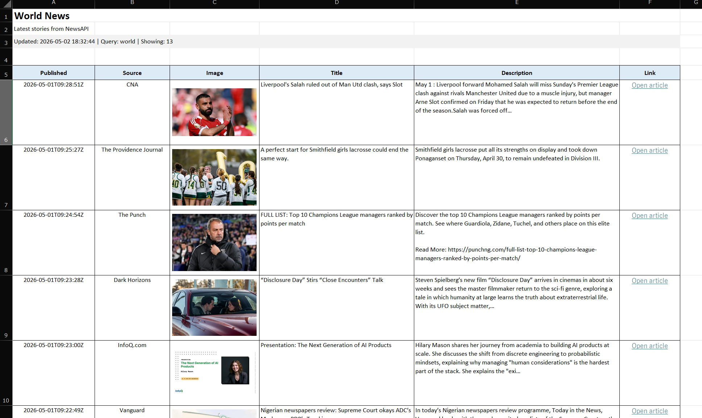
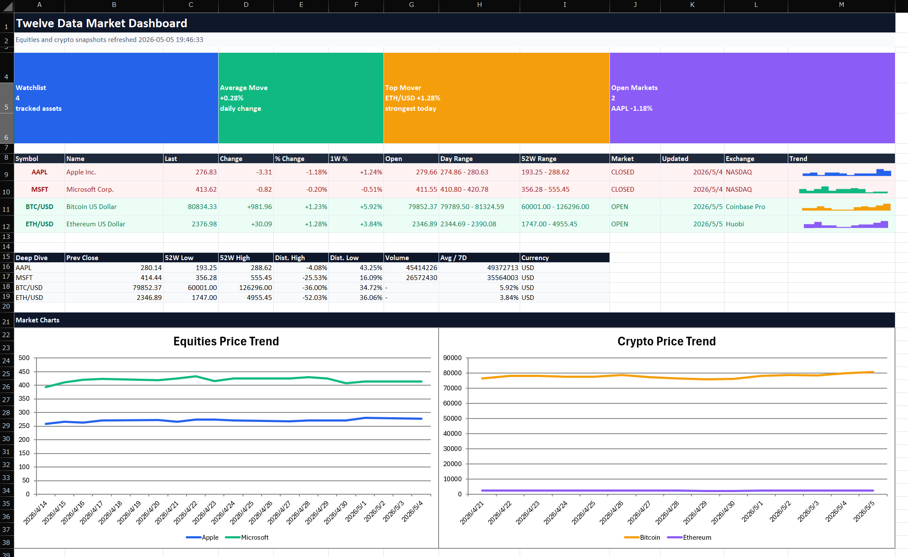
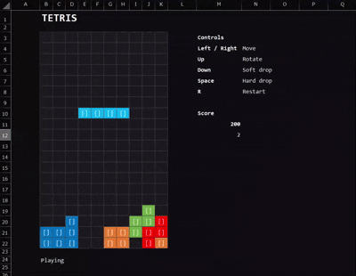
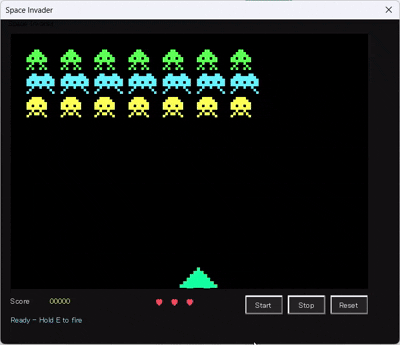
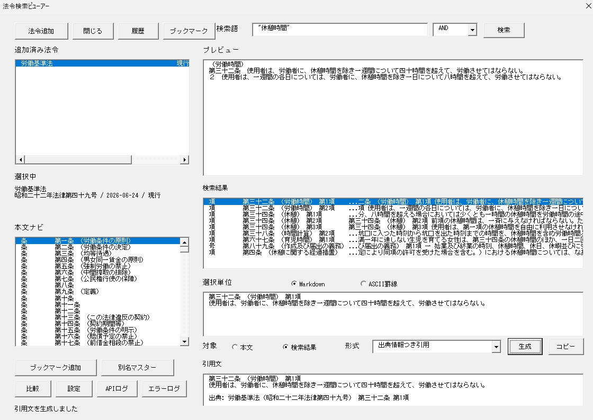
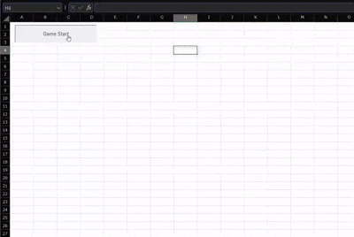
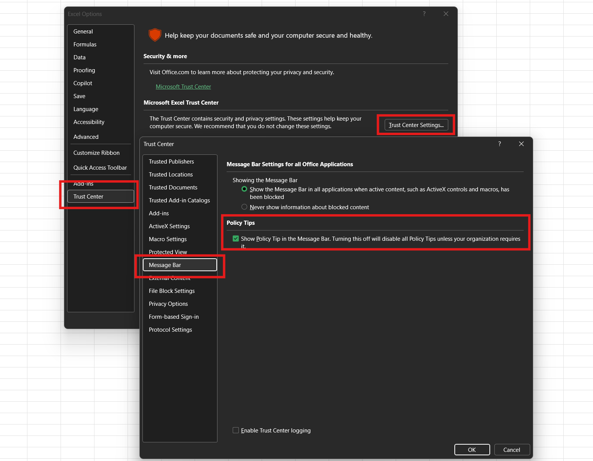

<p align="center">
    
</p>

<p align="center">
  <em>为优先使用 CLI 的开发者与 AI 智能体，重新打造 Excel VBA 开发体验。</em>
</p>

<p align="center">
  <a href="https://harumiweb.github.io/xlflow/">官方文档</a>
</p>

<p align="center">
  <a href="README.md">English</a>
  |
  <a href="README.ja.md">日本語</a>
  |
  <a href="README.zh-CN.md">简体中文</a>
</p>

<div align="center">

     
 [](https://deepwiki.com/harumiWeb/xlflow)

</div>

# :surfing_man: xlflow

**xlflow** 是面向 AI 智能体时代的 Excel VBA 开发框架。

它将常被封装在 `.xlsm` 工作簿、`.xlam` 加载项和 `.xlsb` 二进制工作簿中的 VBA，转变为便于源代码管理、可通过 CLI 操作的开发流程。
你可以在命令行中导出、编辑、lint、导入、测试、调试、运行 VBA，并检查差异。


> [!TIP]
> xlflow 并不取代 Excel。它在 Excel VBA 周围提供一套基于 CLI 的开发工具，让人、脚本和 AI 智能体都能更方便地使用 VBA。

## 演示

这些[示例](example)由 AI 智能体借助 xlflow 根据简短的自然语言指令创建。

<table>
  <tr>
    <td align="center" width="50%">
      
      <sub>使用 NewsAPI 汇总世界新闻并显示在 Excel 中的宏</sub>
    </td>
    <td align="center" width="50%">
      
      <sub>获取股价并显示在 Excel 中的宏</sub>
    </td>
  </tr>
  <tr>
    <td align="center" width="50%">
      
      <sub>用单元格颜色绘制二维码并显示在 Excel 中的宏</sub>
    </td>
    <td align="center" width="50%">
      
      <sub>可以在 Excel 中游玩的俄罗斯方块宏</sub>
    </td>
  </tr>
  <tr>
    <td align="center" width="50%">
      
      <sub>可以在用户窗体中游玩的太空侵略者宏</sub>
    </td>
    <td align="center" width="50%">
      
      <sub>精致的日历选择器</sub>
    </td>
  </tr>
  <tr>
    <td align="center" width="50%">
      
      <sub>法律法规数据搜索工具</sub>
    </td>
    <td align="center" width="50%">
      
      <sub>类似吃豆人的游戏</sub>
    </td>
  </tr>
</table>

---

## 为什么需要 xlflow

传统 VBA 开发高度依赖 Excel 界面和 Visual Basic Editor。
手工进行小幅修改时问题不大，但源代码管理、测试、差异审查、AI 智能体协助修改以及可重复执行都会变得困难。

| 传统 VBA 开发中的痛点                             | 使用 xlflow 可以做到                                 |
| ------------------------------------------------- | ---------------------------------------------------- |
| VBA 代码封装在 `.xlsm` / `.xlam` / `.xlsb` 文件中 | 以 `.bas` / `.cls` / `.frm` 文件形式导出和导入       |
| 无法以声明式方式管理 UserForm                     | 使用 `xlflow form build` 根据 YAML 定义生成 UserForm |
| 难以定位运行错误及其原因                          | 返回结构化错误、诊断信息和 debug log                 |
| 难以审查工作簿的改动                              | 比较单元格值、公式、工作表和 VBA 源码差异            |
| AI 智能体难以安全地操作 Excel UI                  | 提供 CLI 命令和稳定的 JSON 输出                      |

```text
pull → fmt → edit → push → lint → test/run → inspect
```

---

## xlflow 的功能

| 领域                                     | 功能                                                                                                              |
| ---------------------------------------- | ----------------------------------------------------------------------------------------------------------------- |
| 源码管理                                 | 导出和导入标准模块、类模块、UserForm、工作簿 / 工作表模块                                                         |
| 执行                                     | 从 CLI 运行带类型参数的宏                                                                                         |
| 测试                                     | 查找并运行 VBA 测试过程                                                                                           |
| 格式化                                   | 对 `.bas` / `.cls` 源文件进行保守、非破坏性的 VBA 格式化                                                          |
| lint                                     | 检查缺少 `Option Explicit`、`Select` / `Activate`、过宽的错误处理、隐式 Variant、Public module field 和交互式操作 |
| 调试                                     | 收集终端日志并返回运行时诊断                                                                                      |
| 差异比较                                 | 比较工作簿单元格值、公式、工作表结构和 VBA 源码差异                                                               |
| AI 智能体集成                            | 返回稳定的 JSON，并安装适用于 Codex / Claude / Cursor / Gemini / GitHub Copilot 等工作流的 Skill                  |
| LSP 服务器                               | 提供补全、跳转到定义和实时诊断等功能                                                                              |
| [VS Code 扩展](editors/vscode/README.md) | 将 xlflow 操作整合到图形界面，并通过 LSP 服务器改善开发体验                                                       |

> [!IMPORTANT]
> xlflow 的工作簿执行以 **Windows 为主**。操作工作簿时会在 Windows 上通过 `.NET` Excel bridge 使用 **Microsoft Excel + COM**。WSL 可以作为开发前端，将 Excel 相关命令委托给 Windows 端的 xlflow。

---

## 运行要求

| 要求                          | 适用场景                                                                                                                                                                   |
| ----------------------------- | -------------------------------------------------------------------------------------------------------------------------------------------------------------------------- |
| Windows                       | Excel COM automation                                                                                                                                                       |
| Microsoft Excel               | `new`、`init`、`list forms`、`inspect form`、`form snapshot`、`form build`、`form export-image`、`pull`、`push`、`run`、`export-image`、`edit`、`test`、`macros`、`doctor` |
| 信任对 VBA 工程对象模型的访问 | 读取和写入 VBA 工程                                                                                                                                                        |

> [!NOTE]
> `lint`、`fmt`、部分 `diff` 和 Go 单元测试等不使用 Excel COM 的操作，也可以在未安装 Excel 的环境中验证。

> [!NOTE]
> xlflow 使用 .NET bridge 执行 COM 操作。旧版 PowerShell bridge 已在 v0.16.0 中移除，目前支持的 bridge mode 为 `auto` 和 `dotnet`。

> [!WARNING]
> 请在 Excel 设置中启用 **信任对 VBA 工程对象模型的访问**。如果未启用，即使已安装 Excel，`pull` / `push` / `run` 等命令也可能失败。
>
> 具体设置位置：Excel 选项 → 信任中心 → 宏设置 → 信任对 VBA 工程对象模型的访问。
> 

---

## 安装

### 快速安装

适合开发者和 AI 智能体的快速安装方式：

```powershell
irm https://harumiweb.github.io/xlflow/install.ps1 | iex
```

### 卸载

若要删除 PATH 项以及 `%LOCALAPPDATA%\xlflow` 下的安装内容，请下载脚本并运行：

```powershell
irm https://harumiweb.github.io/xlflow/install.ps1 -OutFile .\install.ps1
powershell -ExecutionPolicy Bypass -File .\install.ps1 -Action uninstall
```

### winget

```powershell
winget install HarumiWeb.Xlflow
```

升级现有安装：

```powershell
winget upgrade HarumiWeb.Xlflow
```

> [!NOTE]
> winget manifest 提交 upstream 并获批准前，更新可能晚于 GitHub Release。
> 若要立即使用最新 release，请使用安装脚本、Scoop 或 GitHub Releases 中的 ZIP。

### Scoop

```powershell
scoop bucket add harumiweb https://github.com/harumiWeb/scoop-bucket
scoop install xlflow
```

### GitHub Releases

可从以下页面下载适用于 Windows x64 和 Linux x64 的预编译二进制文件：

[https://github.com/harumiWeb/xlflow/releases](https://github.com/harumiWeb/xlflow/releases)

> [!IMPORTANT]
> 操作工作簿的命令需要 Windows 上的 **Microsoft Excel**、Excel COM automation，以及启用 **信任对 VBA 工程对象模型的访问**。
> Windows release ZIP 同时包含 `xlflow.exe` 和 `xlflow-excel-bridge.exe`。这类命令在 `auto` mode 下使用随包提供的 `.NET` bridge。
> Linux x64 archive 仅包含 WSL/frontend CLI，不包含 Windows `.NET` bridge。

> [!WARNING]
> `xlflow-excel-bridge.exe` 不受 PowerShell execution policy 影响，但可能被 AppLocker、WDAC、Defender / EDR policy、antivirus reputation 或 unsigned executable rule 等策略拦截。公开的 checksum 和 GitHub attestation 可用于验证 artifact 的 integrity 和 provenance，但它们不代表 Windows Authenticode signing。

下载的 ZIP 可与公开的 `checksums.txt` 对照，验证 SHA256：

```powershell
Get-FileHash .\xlflow_windows_x86_64.zip -Algorithm SHA256
certutil -hashfile .\xlflow_windows_x86_64.zip SHA256
```

请确认显示的 SHA256 与 `checksums.txt` 中 `xlflow_windows_x86_64.zip` 对应的值一致。

> 该检查只能确认下载文件与已公开的 checksum file 一致，不能证明发布者身份，也不能替代 Windows Authenticode signing。

也可以通过 GitHub CLI 验证 GitHub Actions provenance attestation：

```powershell
gh attestation verify .\xlflow_windows_x86_64.zip --repo harumiWeb/xlflow
```

> 此验证只能确认 release artifact 存在可验证的 GitHub artifact attestation，不代表它经过 Windows publisher certificate 的 Authenticode signing。

### Go install

```bash
go install github.com/harumiWeb/xlflow/cmd/xlflow@latest
```

`go install` 可能会访问 Go 环境中配置的 Go module 镜像和 checksum database。从检出的源码开发或运行 CI 时，请以 `go.mod` 中声明的 Go 版本作为正式支持工具链的依据。仓库的 CI / release 工作流也会根据该值选择 Go 版本。

> [!WARNING]
> `go install` 只会安装 `xlflow` 主程序，不会安装 Windows release ZIP 中的 `.NET` bridge sidecar `xlflow-excel-bridge.exe`。
> Windows release archive 包含 `.NET` bridge sidecar。从仓库源码安装时，请使用 `task install`，以同时安装 `xlflow.exe` 和 `xlflow-excel-bridge.exe`。

安装后可运行以下命令确认：

```bash
xlflow version
xlflow --help
```

在开发中的仓库中直接运行：

```bash
go run ./cmd/xlflow --help
```

如果使用 Taskfile：

```bash
task run -- --help
```

---

## 在 WSL 中开发

WSL 可作为编辑和自动化的前端，Excel 执行后端仍运行在 Windows 上。
Excel 不会在 WSL 内启动。操作工作簿的命令会委托给 Windows 端的 `xlflow.exe`，随后使用随包提供的 `.NET` bridge 和 Microsoft Excel COM automation。

推荐的设置步骤：

1. 先在 Windows 端安装 xlflow。可使用 installer、winget、Scoop 或 Windows release ZIP。
2. 在 WSL shell 中安装 WSL frontend。

```bash
curl -fsSL https://harumiweb.github.io/xlflow/install.sh | sh
```

3. 请将 xlflow 项目放在 Windows 挂载路径下，例如 `/mnt/c/dev/my-vba-project`。

> [!WARNING]
> `/home/user/project` 等 WSL 专用路径不受委托式 Excel automation 正式支持。工作簿路径必须能被 Windows Excel 和 COM 访问。

开始工作前，从 WSL 运行诊断：

```bash
xlflow doctor --json
```

若还要确认 Windows Excel 能打开已配置的工作簿，请运行 `xlflow doctor --workbook --json`。

如果 WSL 找不到 Windows 端的 executable，可以显式指定：

```bash
export XLFLOW_WINDOWS_EXE='C:\Users\you\AppData\Local\xlflow\xlflow.exe'
```

日常宏开发建议使用 session 工作流，这样可以在保持 Excel 打开的同时反复编辑：

```bash
xlflow session start --json
xlflow push --fast --session --no-save --json
xlflow run Main.Run --session --json
xlflow inspect cell --sheet Sheet1 --address A1 --session --json
xlflow save --session --json
xlflow session stop --json
```

如果 `run`、`test` 或 bridge cleanup 返回时无法确认 Excel/VBA 已停止，xlflow 会隔离该工作簿。之后的工作簿命令会返回 `workbook_recovery_required`，`--wait` 无法绕过此状态。请检查 `xlflow status --json`，并通过 `session stop --discard`、相应的 `process cleanup` 或 `xlflow recovery clear` 恢复。

`lint`、`fmt`、`analyze`、`diff` 等仅处理源码的命令可在 WSL 内运行。`new`、`init`、`pull`、`push`、`run`、`test`、`inspect`、`save`、`doctor` 等需要 Excel 的命令会自动委托给 Windows。

---

## 快速开始

### 1. 创建或初始化项目

创建新的 xlflow 项目和启用宏的工作簿：

```bash
xlflow new Book.xlsm
```

`new` 会把 scaffold 生成的 VBA module 自动 `push` 到新工作簿，因此之后执行 `pull` 也会得到相同的初始状态。

若要从现有 Excel 工作簿开始，请使用 `init`：

```bash
xlflow init Book.xlsm
```

`init` 会从复制的工作簿自动 `pull` 到 `src/`，因此无需额外执行 bootstrap `pull` 就可以开始编辑源码。

同时安装面向 AI 智能体的 Skill：

```bash
xlflow new Book.xlsm --with-skill --agent codex
```

交互式运行 `xlflow new` / `xlflow init` 时会显示 welcome banner，并可能通过 GitHub Releases API 检查最新 GitHub Release。若只想在本次运行中跳过此请求，请使用 `--no-update-check`；若要在整个环境中禁用，请设置 `XLFLOW_NO_UPDATE_CHECK=1`。

### 2. 检查 Excel automation 环境

```bash
xlflow doctor --json
```

> [!TIP]
> `doctor` 默认执行轻量诊断。若要确认能否打开配置的工作簿，请运行 `xlflow doctor --workbook --json`。
>
> 如果 `pull` / `push` / `run` / `test` 因 Excel、COM、bridge、VBIDE 或工作簿打开设置而失败，请先运行 `doctor`。

### 3. 将 VBA 导出为源码文件

```bash
xlflow pull --json
```

导出的 `.bas` / `.cls` / `.frm` 会写入 `src/`。
启用 folder mode 后，各源码根目录下的嵌套目录会在 `push` 时映射为兼容 Rubberduck 的 `@Folder(...)` annotation。
你可以使用普通编辑器或 AI 智能体修改这些文件。

### 4. 将编辑后的源码导入工作簿

```bash
xlflow push --json
```

### 5. 查找并运行宏

```bash
xlflow macros --json
xlflow run Main.Run --json
```

无人值守执行时建议使用 headless mode：

```bash
xlflow run Main.Run --headless --json
```

如果宏使用 `XlflowUI.MsgBox` 或 `XlflowUI.InputBox`，可以传入预设响应并继续以 headless mode 运行。若要在终端实时查看 dialog 处理过程，同时保持 JSON stdout 有效，请添加 `--ui-stream`。

```bash
xlflow run Main.Run --headless --msgbox confirm-save=yes --inputbox customer-name=fallback-user --ui-stream --json
```

`--ui-stream` 会将类似 `xlflow: ui kind=msgbox id=confirm-save source=default result=yes` 的行写入 stderr。InputBox 的值默认会被脱敏；启用 `--ui-stream` 后，最终 JSON 结果的顶层 `ui.events` 也会包含相同的 dialog event。

需要由人操作文件选择框、MsgBox 或 UserForm 时，请使用 interactive mode：

```bash
xlflow run Main.Run --interactive --timeout 5m --json
```

### 6. 运行 lint 和 test

```bash
xlflow lint --json
xlflow test --json
```

测试使用 `XlflowUI` 时，也可传入相同的 response flag 和 realtime stream：

```bash
xlflow test --msgbox test-confirm=ok --inputbox test-user=alice --ui-stream --json
```

---

## 常见工作流

### 让 AI 智能体编辑 VBA

#### 安装 Skill

若要让 AI 智能体使用 xlflow 编辑 VBA，建议在智能体运行环境中安装 xlflow 提供的 **Skill**。

```bash
xlflow skill install
```

也可以在创建项目时一并安装：

```bash
xlflow new Book.xlsm --with-skill
```

如果希望通过 `vercel-labs/skills` 等管理器管理 skill，可使用以下命令安装：

```bash
npx skills add harumiWeb/xlflow/internal/agentskill/templates --skill xlflow
```

#### 创建项目

也可以让 AI 智能体从头创建项目，但建议由人先完成初始项目设置。

```bash
xlflow new Book.xlsm --with-skill
```

#### 让 AI 智能体编辑

使用已安装的 skill，以自然语言告诉代理你想实现什么：

```text
/xlflow 用 VBA 创建一个宏，在单元格 A1 中输入 "Hello, world!"
```

随附的 xlflow skill 也会说明何时在 headless `XlflowUI` 流程中添加 `--ui-stream`、如何保持 stdout 中的 JSON 有效，以及如何查看运行后的 human-readable UI section 和 JSON `ui.events`。

### 人在 Excel 中操作时协同开发

人在 Excel 打开的状态下工作时，可通过 `attach` 查看当前活动工作簿：

```bash
xlflow attach --active --json
```

> [!NOTE]
> `attach` 用于安全确认，会验证当前活动工作簿是否与 `xlflow.toml` 的 `excel.path` 一致。它不会更改 `pull` / `push` / `run` 的目标工作簿。

在 Windows 上，`attach`、`session`、`runner`、`list forms`、`ui button`、`edit` 和 `new` 也会在 `auto` mode 下使用 `.NET` bridge。

### 处理包含 GUI 的宏

在判断能否使用 headless mode 前，先检查 GUI boundary：

```bash
xlflow inspect-gui --json
```

| 结果                                                     | 建议做法                                      |
| -------------------------------------------------------- | --------------------------------------------- |
| 没有 GUI boundary                                        | `xlflow run ... --headless --json`            |
| 检测到文件选择框、`InputBox`、modal `MsgBox` 或 UserForm | 使用 `XlflowUI.MsgBox` 或 `XlflowUI.InputBox` |
| GUI 操作包裹了实际业务逻辑                               | 将 core logic 拆分为带参数的 headless 过程    |

> [!WARNING]
> Headless automation 不适合 modal Excel UI。无人值守执行前请使用 `inspect-gui`，并考虑将现有 `MsgBox` 或 `InputBox` 替换为 `XlflowUI`。

### 在 VBA 中读取运行模式

通过 `xlflow new` 新建的项目包含 `src/modules/Xlflow/XlflowRuntime.bas`。在运行 `xlflow run` 或 `xlflow test` 前，xlflow 会临时注入仅对该工作簿有效的运行模式 marker，VBA 因而无需检查进程就能分支处理。

```vb
If XlflowRuntime.IsHeadless() Then
  Debug.Print "running unattended in " & XlflowRuntime.ModeName()
Else
  MsgBox "Running interactively"
End If
```

`run --headless` 会解析为 `headless`，`run --interactive` 会解析为 `interactive`，`test` 会解析为 `test`。普通 `run` 除非 xlflow 执行进程的环境变量 `XLFLOW_MODE=interactive|headless|ci|agent|test` 已设置，否则会使用 `interactive`。

---

## VS Code 扩展

xlflow 也致力于成为适合人类使用的 Excel VBA 宏开发工具，并提供 VS Code 扩展。
该扩展可通过图形界面调用 xlflow CLI 的大部分主要操作。

它还与 LSP 服务器集成，为手动编写代码提供基于类型推断的补全、跳转到定义和实时诊断等功能。

可从 [Visual Studio Marketplace](https://marketplace.visualstudio.com/items?itemName=harumiWeb.xlflow-vscode) 安装。


> [!IMPORTANT]
> xlflow 扩展只是通过图形界面调用 xlflow CLI 的封装。
> 使用扩展时也必须安装 xlflow CLI。

---

## 命令速查

| 命令                | 用途                                                                 | 示例                                                                         |
| ------------------- | -------------------------------------------------------------------- | ---------------------------------------------------------------------------- |
| `new`               | 创建新的 xlflow 项目和 `.xlsm` 工作簿                                | `xlflow new Book.xlsm`                                                       |
| `init`              | 从现有工作簿初始化 xlflow 项目                                       | `xlflow init Book.xlsm`                                                      |
| `doctor`            | 检查 Excel、COM、`.NET` bridge、VBIDE 访问权限和可选的工作簿打开流程 | `xlflow doctor --workbook --json`                                            |
| `attach`            | 验证 Excel 当前活动的工作簿                                          | `xlflow attach --active --json`                                              |
| `backup list`       | 列出可用于 rollback 的工作簿备份                                     | `xlflow backup list --json`                                                  |
| `pull`              | 将 VBA component 导出到 `src/`                                       | `xlflow pull --json`                                                         |
| `push`              | 将 VBA 源码导入工作簿                                                | `xlflow push --json`                                                         |
| `rollback`          | 从已保存的备份恢复工作簿                                             | `xlflow rollback --latest --json`                                            |
| `session`           | 保持工作簿打开，以便快速迭代                                         | `xlflow session start`                                                       |
| `status`            | 显示项目、源码、工作簿和 session 状态                                | `xlflow status --json`                                                       |
| `save`              | 保存 session 中的工作簿                                              | `xlflow save --session --json`                                               |
| `recovery`          | 检查并清除工作簿的 recovery-required 状态                            | `xlflow recovery clear --json`                                               |
| `runner`            | 管理持久化的 xlflow runner marker module                             | `xlflow runner install --json`                                               |
| `process`           | 管理本地 Excel process（列出、结束）                                 | `xlflow process list --json`                                                 |
| `macros`            | 查找可运行的宏入口                                                   | `xlflow macros --json`                                                       |
| `list forms`        | 列出工作簿中的 UserForm 及其预期源码路径                             | `xlflow list forms --json`                                                   |
| `form snapshot`     | 将 Designer UserForm state 保存为 JSON/YAML spec                     | `xlflow form snapshot UserForm1 --out src/forms/specs/UserForm1.yaml --json` |
| `form build`        | 根据已保存的 spec 创建 Designer-backed UserForm                      | `xlflow form build src/forms/specs/UserForm1.yaml --json`                    |
| `form export-image` | 将运行中的 UserForm 导出为 PNG 图片                                  | `xlflow form export-image UserForm1 --out artifacts/UserForm1.png --json`    |
| `run`               | 从 CLI 运行宏                                                        | `xlflow run Main.Run --json`                                                 |
| `export-image`      | 将 worksheet range 导出为 PNG 图片                                   | `xlflow export-image --sheet QR --range A1:AE31 --json`                      |
| `edit`              | 修改实时 session 工作簿，以便准备和调整                              | `xlflow edit cell --sheet Input --cell B2 --value ABC123 --session --json`   |
| `test`              | 运行 VBA 测试                                                        | `xlflow test --json`                                                         |
| `diff`              | 比较工作簿内容及可选的 VBA 源码                                      | `xlflow diff before.xlsm after.xlsm --json`                                  |
| `inspect`           | 检查已保存的工作簿快照或明确指定的实时 session 状态                  | `xlflow inspect range --sheet Result --address A1:F20 --session --json`      |
| `lint`              | 对 VBA 源码执行 lint                                                 | `xlflow lint --json`                                                         |
| `fmt`               | 保守地格式化 VBA 源码                                                | `xlflow fmt --write --json`                                                  |
| `encoding`          | 检查或转换受管理的 VBA 源码编码                                      | `xlflow encoding check --json`                                               |
| `analyze`           | 不打开 Excel，分析运行时风险模式                                     | `xlflow analyze --json`                                                      |
| `check`             | 一并运行 `lint` / `analyze` / `doctor`                               | `xlflow check --keepalive --json`                                            |
| `inspect-gui`       | 查找 GUI interaction boundary                                        | `xlflow inspect-gui --json`                                                  |
| `skill install`     | 安装面向 AI 智能体的 Skill                                           | `xlflow skill install --agent codex`                                         |
| `version`           | 显示已安装 xlflow 的 build metadata                                  | `xlflow version`                                                             |

---

## 命令详细说明

各命令的详细行为、选项、JSON 输出和故障排除内容已移至文档网站。

- [命令参考](https://harumiweb.github.io/xlflow/commands/)
- [JSON 输出](https://harumiweb.github.io/xlflow/reference/json-output)
- [配置](https://harumiweb.github.io/xlflow/reference/config-file)
- [故障排除](https://harumiweb.github.io/xlflow/reference/troubleshooting)

README 侧重项目介绍和快速入门；详细信息请参阅文档网站。

---

## 配置文件

xlflow 会读取项目根目录中的 `xlflow.toml`。

```toml
# 项目标识信息和入口点
[project]
# 输出消息中使用的项目名称。省略时使用工作簿文件名。
name = "Book"
# 运行 xlflow run 时未指定宏名称的情况下调用的默认宏。
entry = "Main.Run"

# Excel automation 设置
[excel]
# 工作簿路径，可以是相对于项目根目录的路径，也可以是绝对路径。
path = "build/Book.xlsm"
# automation 期间是否显示 Excel 应用程序窗口。
visible = false
# 禁用 Excel 提示框，例如覆盖确认。
display_alerts = false
# Excel bridge mode。有效值："auto"、"dotnet"。
bridge = "auto"

# 源码目录结构
[src]
# 标准模块（.bas）目录。
modules = "src/modules"
# 类模块（.cls）目录。
classes = "src/classes"
# UserForm（.frm）文件目录。
forms = "src/forms"
# 工作簿文档模块文本目录。
workbook = "src/workbook"

# VBE component 文件夹支持（Rubberduck 风格）
[vba]
# 启用 @Folder("A.B") 注解和嵌套源码路径。
folders = true
# push 时 xlflow 对 @Folder annotation 的处理方式。
# 有效值："update"、"preserve"、"ignore"。
#   "update"  - 根据源码目录结构重写。
#   "preserve" - 保留现有注解。
#   "ignore"  - 禁用文件夹注解的读写。
folder_annotation = "update"
# 根据源码路径自动分配默认文件夹注解。
default_component_folders = true

# 可选的 Erl instrumentation。启用后，只为 push 使用的临时导入副本添加行号，
# 纳入版本控制的源码文件保持不带行号。
# [vba.line_numbers]
# enabled = true

# UserForm source mode
[userform]
# UserForm code-behind 在源码目录中的位置。
# 有效值："frm"、"sidecar"。
#   "frm"     - 代码保存在导出的 .frm 文件中。
#   "sidecar" - 代码拆分到 src/forms/code/<FormName>.bas。
code_source = "sidecar"

# 发布构建的源码筛选。只影响 build；push 和 pack 始终使用完整源码目录。
[build]
# 从 xlflow build 中排除的、相对于项目根目录的 doublestar glob。
exclude = [
  "src/modules/Tests/**",
  "src/modules/Xlflow/XlflowAssert.bas",
]

# Procedure 复杂度指标
[metrics]
# 从指标收集中排除的、相对于项目根目录的 doublestar glob。
exclude = []

# 0 表示禁用该阈值；正数表示严格上限。
[metrics.thresholds]
cyclomatic_complexity = 0
max_nesting_depth = 0
statement_count = 0
source_line_count = 0
branch_count = 0
loop_count = 0
goto_count = 0
exit_point_count = 0
parameter_count = 0
byref_parameter_count = 0
local_variable_count = 0
call_fan_out = 0

# 可选的 hotspot 排名。top-N 或 score threshold 为 0 时禁用。
[metrics.hotspots]
procedure_top_n = 0
module_top_n = 0
procedure_score_threshold = 0
module_score_threshold = 0

# 自动备份保留默认禁用。取消注释并设为 enabled = true 后，
# 对配置的工作簿执行会生成备份的 push 和 rollback 成功后，将清理旧的元数据备份。
# [backup.retention]
# enabled = false
# max_count = 20
# max_age_days = 30
# min_keep = 5
# max_total_size_mb = 2048

# VBA formatter 设置
[fmt]
# 在 xlflow fmt 中规范安全二元运算符周围的空格。
operator_spacing = true
# 在 xlflow fmt 中规范安全 VBA 声明的空格。
declaration_spacing = true
# 规范 VBA keyword 的大小写。
keyword_casing = true
# 规范已知 VBA/Excel/Office 内置 identifier 的大小写。
builtin_casing = true

# 源码预检诊断豁免
[preflight]
# 获准的诊断仍会显示；这里只豁免其阻止源码预检的效果。
# Excel/VBE 编译仍可能失败。
allowed_diagnostics = []

# 静态分析规则
[lint]
# 按诊断 ID 禁用特定 lint rule。
#
# 示例：
# disabled_rules = [
#   "VB006", # 允许此旧项目中的 public module field。
# ]
disabled_rules = []

# VB020（未使用的局部变量）警告默认启用。
# 若项目有意保留临时局部变量，请将 "VB020" 添加到 disabled_rules。
#
# 可选的全项目 lint rule。它们在 callback 较多或由工作簿驱动的 VBA 中
# 可能产生较多提示，因此默认禁用。取消对应设置的注释即可启用。
# detect_scope_shadowing = true          # VB018
# detect_unused_private_procedures = true # VB021
# detect_nested_with_ambiguity = true    # VB027

# 可选的本地 procedure 名称常量检查（VB044）。
# [lint.procedure_name_constant]
# enabled = true
# constant_name = "PROCEDURE_NAME"

# 运行时风险分析规则
[analyze]
# 按诊断 ID 禁用特定 analyzer rule。
#
# 示例：
# disabled_rules = [
#   "VBA205", # 允许此旧项目依赖 active worksheet。
# ]
disabled_rules = []

# 该 allowlist 仅匹配规范化后的 http://host[:port] origin，
# 只会抑制 VBA246 plain_http_credentials 检查。它不会允许 HTTP 请求，也不会抑制
# credentials_in_url、authorization_logging、TLS/certificate、
# sensitive_module_constant 或 download_and_execute 检查。
development_http_origins = []

# 可选的 dataflow analyzer rule 默认禁用。
# 若要检查 Function 和 Property Get 的 return path，请取消下行注释。
# detect_function_return_path = true # VBA210
```

未指定宏名称运行 `xlflow run` 时会使用 `project.entry`。

如果项目需要交互操作并有意使用 `UserForm` 或 dialog，可设置 `[lint].disabled_rules = ["VB007"]` 来抑制 `VB007` warning。此设置只影响 lint；`xlflow run --headless` 的 GUI boundary check 仍会阻止执行。为了兼容性，仍接受 `forbid_interactive_input = false` 等旧版逐规则布尔设置，但不推荐使用。

语法安全 lint 始终启用，用于检测弯引号、C-style quote escape、未闭合或配对错误的 procedure，以及行续接符 `_` 前空格不足等问题。该规则用于防止 `push` 或 `run` 打开 Excel 前出现 VBE compile dialog。

可通过 `[analyze].disabled_rules = ["VBA205"]` 等设置禁用 analyzer rule。`VBA101` 到 `VBA106` 的 analyzer 诊断始终启用。

---

## xlflow 专用内置模块

新项目会在工作簿侧 scaffold 以下 helper module：

- `src/modules/Xlflow/XlflowRuntime.bas`
- `src/modules/Xlflow/XlflowUI.bas`
- `src/modules/Xlflow/XlflowDebug.bas`
- `src/modules/Xlflow/XlflowAssert.bas`

各模块用途如下：

- `XlflowRuntime` 用于 `interactive` / `headless` / `ci` / `agent` / `test` 运行模式分支。
- `XlflowUI` 封装 `MsgBox`、`InputBox`、`Application.GetOpenFilename`、open `Application.FileDialog`、`Application.GetSaveAsFilename` 和 folder picker，让同一份 VBA 可用于交互式和无人值守运行。
- `XlflowDebug` 会在 `xlflow run` / `xlflow test` 期间将 `XlflowDebug.Log` 输出镜像到终端，同时保留普通 VBA Immediate Window 输出。
- `XlflowAssert` 是供工作簿侧测试使用的断言辅助模块，可检查标量相等、严格相等、`Null` / `Empty`、数值容差、字符串、数组、`Range.Value2` 和对象标识。

示例：

```vb
Dim answer As VbMsgBoxResult
Dim files As Variant

answer = XlflowUI.MsgBox("confirm-save", "Save workbook?", vbYesNo + vbQuestion, "Orders")
files = XlflowUI.GetOpenFilename("source-files", MultiSelect:=True)
XlflowDebug.Log "running in", XlflowRuntime.ModeName()
```

无人值守执行时，可从 CLI 提供 dialog response：

```bash
xlflow run Main.Run --headless --msgbox confirm-save=yes --filedialog get-open:source-files=C:\temp\a.txt --filedialog get-open:source-files=C:\temp\b.txt --ui-stream --json
```

若要让 headless file dialog 返回 Cancel，请使用 `@cancel`：

```bash
xlflow run Main.Run --headless --filedialog folder:export-dir=@cancel --json
```

如需在现有项目中添加随附的 helper module，可在初始化时或之后运行：

```bash
xlflow init LegacyBook.xlsm --with-module
xlflow module install --push
```

---

## JSON 输出

所有命令都可添加 `--json`，以返回便于 AI 智能体和脚本处理的 JSON。

基本 envelope 格式如下：

```json
{
  "status": "ok",
  "command": "lint",
  "error": null,
  "logs": []
}
```

失败时，`status` 会变为 `failed`，并返回 `error.code` 和 `error.message`。

```json
{
  "status": "failed",
  "command": "run",
  "error": {
    "code": "macro_failed",
    "message": "Main Err 5: inputPath is required",
    "source": "Main",
    "number": 5,
    "phase": "invoke_macro"
  },
  "logs": []
}
```

> [!TIP]
> AI 智能体和自动化脚本应将 `status`、`command`、`error.code` 以及各命令特有的顶层字段视为主要接口约定。

`workbook_recovery_required` 是操作安全错误，不是普通的锁冲突。请检查 `xlflow status --json` 中的 `coordination.recovery` 并执行返回的恢复操作。强制清除只会移除 xlflow 的 marker，不会停止 VBA 或修复 Excel 状态。

---

## 退出码

| Code | 含义                                                                                                          |
| ---: | ------------------------------------------------------------------------------------------------------------- |
|  `0` | 成功                                                                                                          |
|  `1` | 验证失败，例如 lint/analyze 中 severity 为 error、unknown 或空的诊断（包括 `check` 的源码诊断）、宏或测试失败 |
|  `2` | CLI 参数或配置错误                                                                                            |
|  `3` | 操作或环境错误，例如 busy / recovery state、Excel、COM 或 bridge 错误                                         |

> [!NOTE]
> 即使发现差异，`diff` 也会返回 exit code `0`。请查看 `diff.summary.total_diffs` 判断输入是否不同。
>
> 如果 lint/analyze 结果或 `check` 的源码诊断仅包含 warning 或 information，exit code 为 `0`，诊断仍会保留在输出中供审查。Unknown 或空的 severity 仍会阻止执行并返回 exit code `1`。

---

## 许可证

MIT License。详见 [LICENSE](LICENSE)。

---

## 开发环境设置

如果你要从源码检出版本开发 xlflow，或需要包含仅处理源码的命令、Go CLI、`.NET` Excel bridge 和 Excel COM 工作流的完整本地工具链，请参阅本节。

### 所需工具

| 要求                                     | 用途                                                   |
| ---------------------------------------- | ------------------------------------------------------ |
| Windows x64                              | 基于工作簿的完整开发和 Excel COM 验证                  |
| `go.mod` 中声明的 Go 版本                | 构建和测试 Go CLI                                      |
| MSYS2 UCRT64 `mingw-w64-ucrt-x86_64-gcc` | 构建 `inspect symbols` 使用的 CGO tree-sitter VBA 集成 |
| .NET SDK 8.0 或更高版本                  | 构建 `xlflow-excel-bridge.exe`                         |
| Task                                     | 运行 `task install` 等仓库任务                         |
| Microsoft Excel                          | 工作簿命令端到端验证及发布级 COM 验证                  |
| 信任对 VBA 工程对象模型的访问            | VBA 导入/导出、编译、UserForm、运行和测试工作流        |

`xlflow inspect symbols` 通过 Go CGO binding 使用 `tree-sitter-vba`。因此，从源码构建 xlflow 需要可正常工作的 Windows C compiler。请使用 MSYS2 UCRT64 GCC，不要使用较旧的 TDM-GCC 安装。

安装 MSYS2 compiler：

```powershell
winget install MSYS2.MSYS2
C:\msys64\usr\bin\bash.exe -lc "pacman -Syu --noconfirm"
C:\msys64\usr\bin\bash.exe -lc "pacman -S --noconfirm mingw-w64-ucrt-x86_64-gcc"
```

然后选择 UCRT64 compiler，从仓库构建并安装：

```powershell
$env:CC = "C:\msys64\ucrt64\bin\gcc.exe"
task install
xlflow --help
xlflow version
```

如果运行 `task install` 生成的 `xlflow.exe` 时出现 “The specified executable is not a valid application for this OS platform”，请检查当前使用的 C compiler：

```powershell
go env GOOS GOARCH CGO_ENABLED CC
where.exe gcc
```

如果 CGO 通过不兼容的 GCC 发行版（例如 `C:\TDM-GCC-64\bin\gcc.exe`）进行链接，就可能出现此错误。请删除有问题的二进制文件，将 `CC` 指向 MSYS2 UCRT64 GCC，然后重新安装：

```powershell
Remove-Item "$env:USERPROFILE\go\bin\xlflow.exe" -Force
$env:CC = "C:\msys64\ucrt64\bin\gcc.exe"
task install
```

快速迭代源码时，也可以继续使用 `go run`：

```powershell
go run .\cmd\xlflow --help
go run .\cmd\xlflow inspect symbols --json
go test ./...
```

### Excel COM 验证

不依赖 Excel 的测试可以直接运行；涉及工作簿自动化、VBA 导入/导出、宏执行、session、UserForm 或 bridge 的改动，则需要使用真实 Windows Excel 验证。进行发布级验证前，请在 Excel 中启用 **信任对 VBA 工程对象模型的访问**，并运行 `task install`，确认 Go bin 目录中同时存在 `xlflow.exe` 和 `xlflow-excel-bridge.exe`。

反复检查工作簿时，建议使用基于 session 的工作流：

```powershell
xlflow session start --json
xlflow push --fast --session --no-save --json
xlflow run Main.Run --session --json
xlflow test --session --json
xlflow save --session --json
xlflow session stop --json
```
