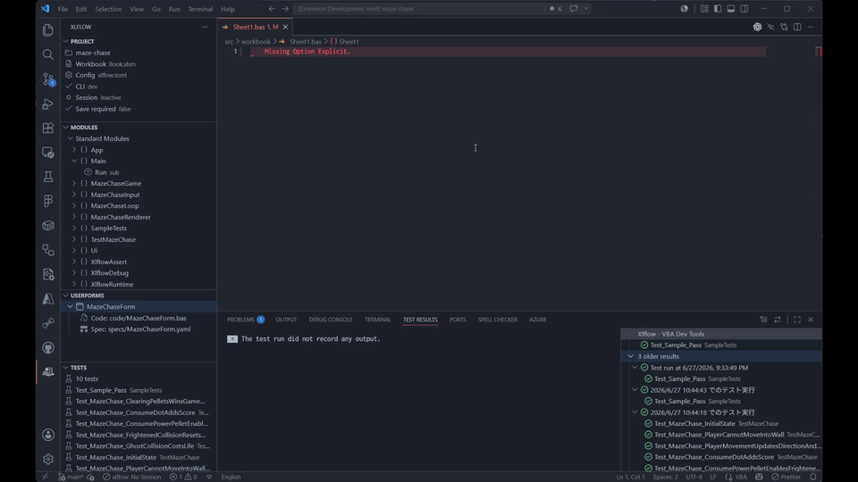
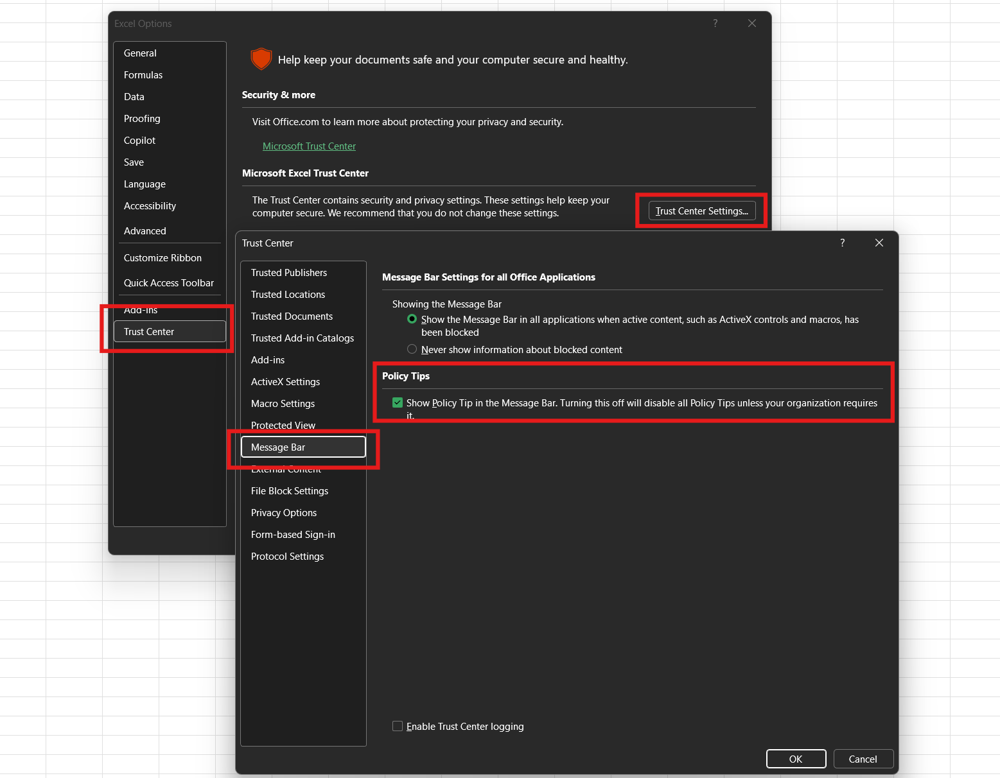

# xlflow for Visual Studio Code

[English](README.md) | [日本語](https://github.com/harumiWeb/xlflow/blob/main/editors/vscode/README.ja.md)

**xlflow for Visual Studio Code** is an extension designed to streamline the use of the Excel VBA macro development support tool [xlflow](https://github.com/harumiWeb/xlflow) within VSCode.
It enables users to perform the following operations directly from VSCode: check the status of xlflow projects, import and apply VBA modules, manage sessions, and execute various commands. This makes developing Excel VBA macros more secure, better suited for Git version control, and easier to integrate with AI development agents.



## About xlflow

[xlflow](https://github.com/harumiWeb/xlflow) is a development support CLI tool originally created to enable AI agents to autonomously develop Excel VBA macros.
It extracts VBA code from Excel workbooks as individual files in formats like .bas, .cls, and .frm, allowing them to be managed via Git and seamlessly reapplied to the workbook after editing.
Additionally, it supports running VBA macros from command line interfaces, including execution, testing, linting, formatting, and static analysis, making it equally suitable for both human development and AI-assisted Excel VBA development.
For **xlflow for Visual Studio Code**, we've **GUI-enabled all these functionalities while also providing a Language Server Protocol (LSP) server to deliver an exceptionally smooth development experience for humans.**

## System Requirements

- This extension is compatible with only **Windows operating systems**.
- You must install [`xlflow`](https://github.com/harumiWeb/xlflow).
- Either add `xlflow` to your system path or set the `xlflow.path` environment variable to the full path to the executable file.
- In Excel settings, ensure "**Trust access to the VBA project object model**" is enabled.
  

### Installation Commands for xlflow Core

- Quick Install

  ```bash
  irm https://harumiweb.github.io/xlflow/install.ps1 | iex

  ```

- Using WinGet

  ```bash
  winget install HarumiWeb.Xlflow

  ```

- Via Scoop

  ```bash
  scoop bucket add harumiweb https://github.com/harumiWeb/scoop-bucket
  scoop install xlflow

  ```

- For installation in WSL (note that separate installation on Windows is also required):

  ```bash
  curl -fsSL https://harumiweb.github.io/xlflow/install.sh | sh

  ```

## Features of This Extension

With **xlflow for Visual Studio Code**, you can perform all the core operations of the xlflow CLI directly from VSCode.
The main features include:

- Displays project status for xlflow projects
- Project recognition based on `xlflow.toml` configuration
- Imports VBA modules from Excel workbooks
- Applies edited VBA modules back to Excel workbooks
- Starts and stops xlflow sessions
- Runs automated tests
- Provides LSP-based code completion and real-time diagnostics
- Offers AST-based static analysis and formatter capabilities
- Lists standard modules, class modules, and other relevant components
- Allows execution of xlflow commands via the command palette
- Includes auxiliary features for VBA development

## Target Use Cases

This extension is ideal for Excel VBA development scenarios such as:

- Managing Excel VBA macros with Git version control
- Editing VBA code in VSCode rather than the VBE environment
- Safely maintaining existing Excel macro assets
- Implementing linting and formatting tools for VBA code
- Delegating Excel VBA development to AI assistants
- Performing synchronized operations between Excel workbooks and source code through a GUI interface
- Integrating Excel VBA with WSL or CLI-based development workflows

## Configuration Notes

To set the execution path for `xlflow` when it's not in the system PATH, configure it as follows:

```json
{
  "xlflow.path": "C:\\path\\to\\xlflow.exe"
}
```

Common configuration options include:

- `xlflow.lsp.enabled`: Launches `xlflow lsp --stdio` for VBA files.
- `xlflow.lsp.logFile`: Specifies the log file to be passed to the language server. The default value is `.xlflow/lsp.log`.
- `xlflow.lsp.trace.server`: Sets the verbosity level for the trace output channel of the language server.
- `xlflow.codeLens.enabled`: Displays xlflow CodeLens actions above executable VBA procedures.
- `xlflow.codeLens.runProcedure`: Shows a "Run" action above executable VBA procedures.
- `xlflow.codeLens.runTests`: Displays a "Run Test" action above VBA test procedures.
- `xlflow.codeLens.userFormEvents`: Shows a "Run" action above event handlers in UserForms.
- `xlflow.run.saveBeforeRun`: Saves modified VBA documents before executing procedures via CodeLens.
- `xlflow.completion.triggerSuggestInStatements`: Triggers VS Code suggestion functionality in contexts where VBA statements are likely to be written.
- `xlflow.completion.progIdsInStrings`: Triggers VS Code suggestion functionality within `CreateObject("...")` and `GetObject("...")` strings.
- `xlflow.testing.autoDiscover`: Automatically detects VBA tests when the xlflow workspace is opened.

## About the Command Interface

The command palette includes the following functionalities:

| Command | Description |
| --- | --- |
| `xlflow: Restart Language Server` | Restarts the VBA language server when completions, diagnostics, or navigation get out of sync. |
| `xlflow: Check Environment` | Verifies that xlflow, Excel integration, and the current workspace are ready to use. |
| `xlflow: New Project` | Creates a new xlflow project scaffold. |
| `xlflow: Initialize Project` | Adds xlflow configuration to an existing workbook project. |
| `xlflow: Install Agent Skill` | Installs the AI-agent skill package for xlflow workflows. |
| `xlflow: Install Helper Modules` | Adds helper VBA modules used by xlflow features and samples. |
| `xlflow: New Module` | Creates a new VBA module with type selection. |
| `xlflow: New Standard Module` | Creates a new standard VBA module. |
| `xlflow: New Class Module` | Creates a new class module. |
| `xlflow: New UserForm` | Creates a new UserForm source set. |
| `xlflow: Pull Workbook` | Imports the current workbook's VBA assets into the workspace. |
| `xlflow: Push Sources` | Applies workspace source changes back into the workbook. |
| `xlflow: Run Macro` | Runs the configured entry macro. |
| `xlflow: Run Procedure` | Runs a selected VBA procedure. |
| `xlflow: Run Test Procedure` | Runs a selected VBA test procedure directly. |
| `xlflow: Run Tests` | Executes the project's VBA test suite. |
| `xlflow: Lint Workspace` | Runs lint checks on the workspace sources. |
| `xlflow: Format Document` | Formats the active VBA document. |
| `xlflow: Format Project` | Formats all supported source files in the project. |
| `xlflow: Save Workbook` | Saves the connected Excel workbook. |
| `xlflow: Start Session` | Starts a reusable Excel session for faster repeated commands. |
| `xlflow: Session Status` | Shows the current xlflow session state. |
| `xlflow: Restart Session` | Reopens the managed Excel session. |
| `xlflow: Stop Session` | Stops the active xlflow session. |
| `xlflow: Open Output` | Opens the xlflow output channel in VS Code. |
| `xlflow: Refresh Project` | Reloads the project tree and related workspace state. |
| `xlflow: Refresh Modules` | Reloads the module list in the sidebar. |
| `xlflow: Refresh UserForms` | Reloads the UserForm list in the sidebar. |
| `xlflow: Refresh Tests` | Reloads discovered tests in the test explorer. |
| `xlflow: Run All Tests` | Runs every discovered VBA test from the sidebar/test view. |
| `xlflow: Run Doctor` | Runs `xlflow doctor` for detailed environment diagnostics. |
| `xlflow: Toggle Session` | Turns session mode on or off for the current workspace. |
| `xlflow: Open Documentation` | Opens the xlflow documentation. |
| `xlflow: Rename Module` | Renames a VBA module and its backing source file. |
| `xlflow: Delete Module` | Deletes a module from the workspace. |
| `xlflow: Reveal Source File` | Opens the file location for the selected module source. |
| `xlflow: Copy Module Name` | Copies the selected module name to the clipboard. |
| `xlflow: Copy Relative Path` | Copies the selected source file path relative to the project root. |
| `xlflow: Copy Procedure Name` | Copies the selected procedure name. |
| `xlflow: Copy Qualified Name` | Copies the fully qualified module and procedure name. |
| `xlflow: Rename UserForm` | Renames a UserForm and its related artifacts. |
| `xlflow: Delete UserForm` | Deletes a UserForm from the workspace. |
| `xlflow: Reveal UserForm Source` | Opens the source location for the selected UserForm. |
| `xlflow: Copy UserForm Name` | Copies the selected UserForm name. |
| `xlflow: Copy UserForm Relative Path` | Copies the selected UserForm source path relative to the project root. |

## Integration with AI Agents

xlflow is a tool specifically designed to enable AI agents to develop Excel VBA macros, featuring a completely CLI-controlled interface with AI-friendly structured outputs.
From Terminal:

```bash
xlflow skill install

```

or through the VSCode Command Pallet:

```bash
xlflow: Install Agent Skill

```

By installing the **Agent Skill** for AI agents using these methods, any coding agent—whether Codex, Claude Code, GitHub Copilot, or Cursor—can proficiently utilize xlflow to develop Excel VBA macros fully autonomously.
This integration makes it much easier to incorporate test-driven development and auto-correction workflows into Excel VBA development.


## WSL Integration Notes

xlflow supports workflows that connect Excel on Windows to development environments running on WSL.
You can edit VBA code directly from editors or AI agents on WSL, then import, apply, and execute changes back to Excel on Windows.
For WSL integration, please note the following requirements:
You must install xlflow on both the Windows and WSL systems
Your target project files must be located in a shared directory accessible from both Windows and WSL, such as `/mnt/c/...`
Windows-installed Microsoft Excel is required for working with Excel workbooks
For detailed instructions, refer to the [official xlflow documentation](https://harumiweb.github.io/xlflow/installation#wsl-development-frontend).

## Troubleshooting Guide

### "xlflow" Command Not Found

Please verify that the `xlflow` CLI is installed.
In the terminal, run the following command:

```bash
xlflow version

```

If you cannot find the command, please either install the xlflow CLI or specify the `xlflow.path` in your VSCode settings.

### Project Not Recognized

Check whether an `xlflow.toml` file exists at the root of your workspace or within the target folder.

```txt
my-project/
  xlflow.toml

```

If the `xlflow.toml` file is missing, perform project initialization either through the command palette or via the dedicated sidebar interface.

```bash
xlflow: Initialize Project

```

### Failure to Operate Excel Workbooks

Excel workbook operations require Microsoft Excel installed on Windows.
For proper operation, please ensure the following:

- Whether Microsoft Excel is installed
- Whether the target workbook can be opened
- Whether access to VBA projects is allowed
- Whether the workbook is not protected
- Whether another Excel process has locked the workbook

### Inaccessible from WSL

When using WSL integration, the project must be located in a path accessible from both Windows and WSL sides.
Recommended deployment structure:

```txt
/mnt/c/dev/my-xlflow-project

```

Additionally, verify that xlflow can be executed on both Windows and WSL environments.

## Known Limitations

- This extension does not install or bundle `xlflow` itself.
- Macro selection functionality is not yet available for interactive operations. Running `xlflow: Run Macro` will execute the pre-configured default macro. Standalone `Sub` procedures without arguments can be launched via CodeLens.
- Both `xlflow: New Project` and `xlflow: Initialize Project` only display basic CLI workflows and do not provide a picker for selecting options like `--with-skill`, `--with-module`, `--agent`, or `--json`.
- This extension does not implement VBA code analysis, diagnostics, formatting, suggestion displays, symbol analysis, or type inference capabilities in TypeScript.

## Documentation

For detailed usage instructions, please refer to the following documentation:
[xlflow Documentation](https://harumiweb.github.io/xlflow/)
[GitHub Repository](https://github.com/harumiWeb/xlflow)

## Feedback and Issue Reporting

Please report bugs, request features, or ask questions via GitHub Issues.
[Issues](https://github.com/harumiWeb/xlflow/issues)
When reporting issues, please include the following information if possible:

- Operating system in use
- VSCode version
- xlflow version
- Version of this extension
- Command executed
- Error message
- Reproduction steps

## Development Notes

Use Node.js 22 or later. The extension's test runner uses `@vscode/test-electron` 3.x.
To launch the extension in VS Code's development mode:
From this directory:

```bash
pnpm install
pnpm compile

```

To start the extension host from the [Run and Debug] view after compilation, simply open this folder.

## License

MIT License
